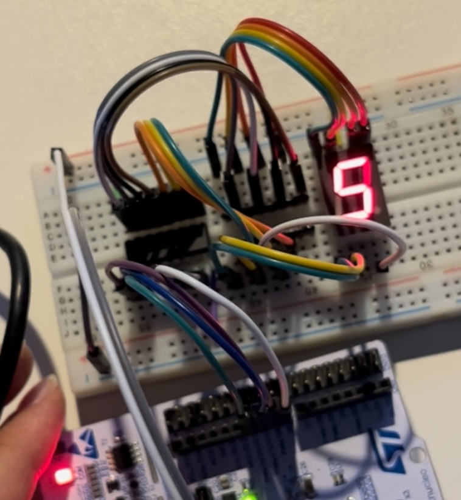
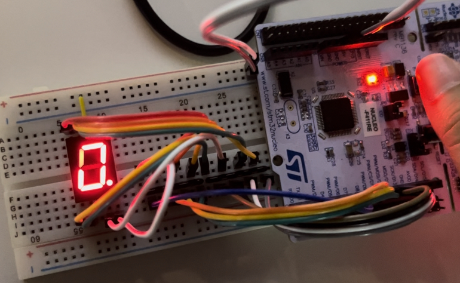

# **LAB: GPIO Digital InOut 7-segment**

**Date:** 2024-09-23

**Author:** Hee-Won Kim

**Github:** [https://github.com/KHW0619/Embedded-Controller/tree/master/LAB/LAB_GPIO_7segment](https://github.com/KHW0619/Embedded-Controller/tree/master/LAB/LAB_GPIO_7segment)

**Demo Video:** [PROBLEM 1](https://youtube.com/shorts/1cACXVU6l_8?feature=share), [PROBLEM 2](https://youtu.be/04grC8DATaQ)

---

## **Introduction**

### **Requirement**

**Hardware**

- MCU
    - NUCLEO-F411RE
- Actuator/Sensor/Others:
    - 7-segment display(5101ASR)
    - Array resistor (330 ohm)
    - decoder chip(74LS47)
    - breadboard

**Software**

- Keil uVision, CMSIS, EC_HAL library

## **Exercise**

Fill in the table

| **Port/Pin** | **Description** | **Register setting**           |
| --- | --- |--------------------------------|
| Port A Pin 5 | Clear Pin5 mode | GPIOA->MODER &=~(3<<(5*2))     |
| Port A Pin 5 | Set Pin5 mode = Output | GPIOA->MODER \|= 1<<(5*2)      |
| Port A Pin 6 | Clear Pin6 mode | GPIOA->MODER &=~(3<<(6*2))     |
| Port A Pin 6 | Set Pin6 mode = Output | GPIOA->MODER \|= 1<<(6*2)      |
| Port A Pin Y | Clear PinY mode | GPIOA->MODER &=~(3<<(Y*2))     |
| Port A Pin Y | Set PinY mode = Output | GPIOA->MODER \|= 1<<(Y*2)      |
| Port A Pin 5~9 | Clear Pin5~9 mode | GPIOA->MODER &=~(0x3FF<<(5*2)) |
|  | Set Pin5~9 mode = Output | GPIOA->MODER \|= 0x155<<(5*2)  |
| Port X Pin Y | Clear Pin Y mode | GPIOX->MODER &=~(3<<(Y*2))     |
|  | Set Pin Y mode = Output | GPIOX->MODER \|= 1<<(Y*2)      |
| Port A Pin5 | Set Pin5 otype=push-pull | GPIOA->OTYPER = 0<<(5)         |
| Port A PinY | Set PinY otype=push-pull | GPIOA-> OTYPER = 0<<(Y)        |
| Port A Pin5 | Set Pin5 ospeed=Fast | GPIOA->OSPEEDR = 2<<(5*2)      |
| Port A PinY | Set PinY ospeed=Fast | GPIOA-> OSPEEDR = 2<<(Y*2)     |
| Port A Pin 5 | Set Pin5 PUPD=no pullup/down | GPIOA->PUPDR = 0<<(5*2)        |
| Port A Pin Y | Set PinY PUPD=no pullup/down | GPIOA-> PUPDR = 0<<(Y*2)       |

---

## **Problem 0: Connection of 7-Segment Display and Decoder**

### **Procedure**

### **Connection Diagram**


### **Discussion**

1. Truth table for the BCD 7-segment decoder with the 4-bit input.

| DECIMAL OR FUNCTION | INPUT D | INPUT C | INPUT B | INPUT A | OUTPUT ~a | OUTPUT ~b | OUTPUT ~c | OUTPUT ~d | OUTPUT ~e | OUTPUT ~f | OUTPUT ~g |
|---------------------|---------|---------|---------|---------|-----------|-----------|-----------|-----------|-----------|-----------|-----------|
| 0                   | L       | L       | L       | L       | L         | L         | L         | L         | L         | L         | H         |
| 1                   | L       | L       | L       | L       | H         | L         | L         | H         | H         | H         | H         |
| 2                   | L       | L       | H       | H       | L         | L         | H         | L         | L         | H         | L         |
| 3                   | L       | L       | H       | H       | L         | L         | L         | L         | H         | H         | L         |
| 4                   | L       | H       | L       | L       | H         | L         | L         | H         | H         | L         | L         |
| 5                   | L       | H       | L       | L       | L         | H         | L         | L         | H         | L         | L         |
| 6                   | L       | H       | H       | H       | H         | H         | L         | L         | L         | L         | L         |
| 7                   | L       | H       | H       | H       | L         | L         | L         | H         | H         | H         | H         |
| 8                   | H       | L       | L       | L       | L         | L         | L         | L         | L         | L         | L         |
| 9                   | H       | L       | L       | L       | L         | L         | L         | H         | H         | L         | L         |

2. What are the common cathode and common anode of 7-segment display?

> They are almost the same, except for the difference between active high and active low.

3. Does the LED of a 7-segment display (common anode) pin turn ON when 'HIGH' is given to the LED pin from the MCU?

> No, the common anode is active low, so the LED does not turn on when 'HIGH' is applied. It turns on when 'LOW' is applied.

---

## **Problem 1: Display a Number with Button Press**

### **Procedure**

> This problem demonstrates an upcounter for a 7-segment display with using a 7-segment decoder. The display changes when the button is pressed.
> <br>
> The maximum number is 9 and the minimum number is 0. Because of that condition, when the 7-segment display shows 9, the next state should be 0.
>
> The following functions are declared in the ecGPIO2.c and ecGPIO2.h. These will be used to solve problem 1.

```
void sevensegment_display_init(PinNames_t pinNameA, PinNames_t pinNameB, PinNames_t pinNameC, PinNames_t pinNameD);
void sevensegment_display(uint8_t  num);
```

### **Configuration**

Configure the MCU

| Digital In for Button (B1) | Digital Out for 7-Segment |
| --- | --- |
| Digital In | Digital Out |
| PC13 | PA7, PB6, PC7, PA9 |
| PULL-UP | Push-Pull, No Pull-up-Pull-down, Medium Speed |

### **My Code**

```C
/*
******************************************************************************
* @author  Hee-Won Kim
* @Mod	   2024-09-22 by KHW0619
* @brief   Embedded Controller:  LAB_GPIO_7segment problem 1
******************************************************************************
*/

#include "stm32f4xx.h"
#include "ecGPIO2.h"
#include "ecRCC2.h"

#define BUTTON_PIN PC_13

// Initialiization
void setup(void);

int main(void) {
    // Initialiization --------------------------------------------------------
    setup();
    unsigned int cnt = 0;
    int button_state = 0;
    int button_state_prev = 0;
    int iter = 500000;

    // Inifinite Loop ----------------------------------------------------------
    while(1){
        for(int i = 0; i < 500000;i++){}  // delay_ms(500);

        // software debouncing and read the button state
        for(int iter_count = 0; iter_count < iter; iter_count++){};
        button_state = GPIO_read(BUTTON_PIN);

        // check the button state change
        if(button_state_prev && !button_state) {
            // software debouncing and double-check the button state
            for(int iter_count = 0; iter_count < iter; iter_count++){};
            button_state = GPIO_read(BUTTON_PIN);

            // change LED pin's output state
            if(!button_state)
                if(GPIO_read(BUTTON_PIN) == 0) cnt++;
            if (cnt > 9) cnt = 0;
        }
        // turn on the 7segment display by using sevensegment_display() function
        sevensegment_display(cnt % 10);

        button_state_prev = button_state;
    }
}

// Initialiization
void setup(void)
{
    RCC_HSI_init();
    GPIO_init(BUTTON_PIN, INPUT);
    GPIO_pupd(BUTTON_PIN, PULL_UP);
    sevensegment_display_init(PA_7, PB_6, PC_7, PA_9);  // Decoder input A,B,C,D
}
```

### **Connection Diagram**


### **Results**

> The following results can be observed:

|  0      |  1      |  2      |
|------------------------------------------|------------------------------------------|------------------------------------------|
|  3      |  4      |  5      |
|  6      |  7      |  8      |
|  9      |                                          |                                          |

### **Discussion**

> The problem involves reading the information of each digit from a 4-bit binary number and using the GPIO_write() function to output it. When reading the digit information, a bitwise 'AND' operation was used.

---

## **Problem 2: Program BCD-7-segment decoder**

> Instead of using a decoder chip, we'll control the 7segment display by programming.

### **Procedure**

> This problem demonstrates an upcounter for a 7-segment display without using a 7-segment decoder. The display changes when the button is pressed.
> <br>
> The maximum number is 9 and the minimum number is 0. Because of that condition, when the 7-segment display shows 9, the next state should be 0.
>
> The following functions are declared in the ecGPIO2.c and ecGPIO2.h. These will be used to solve problem 2.

```C
void sevensegment_decoder_init(void);
void sevensegment_decoder(uint8_t  num);
```

### **Configuration**

Configure the MCU

| Digital In for Button (B1) | Digital Out for 7-Segment |
| --- | --- |
| Digital In | Digital Out |
| PC13 | PA5, PA6, PA7, PB6, PC7, PA9, PA8, PB10
('a'~'h', respectively) |
| PULL-UP | Push-Pull, No Pull-up-Pull-down, Medium Speed |

### **My Code**

```C
/*
******************************************************************************
* @author  Hee-Won Kim
* @Mod	   2024-09-23 by KHW0619
* @brief   Embedded Controller:  LAB_GPIO_7segment problem 2
******************************************************************************
*/

#include "stm32f4xx.h"
#include "ecGPIO2.h"
#include "ecRCC2.h"

#define BUTTON_PIN PC_13

// Initialiization
void setup(void);

int main(void) {
    // Initialiization --------------------------------------------------------
    setup();
    unsigned int cnt = 0;
    int button_state = 0;
    int button_state_prev = 0;
    int iter = 500000;

    // Inifinite Loop ----------------------------------------------------------
    while(1){
        for(int i = 0; i < 500000;i++){}  // delay_ms(500);

        // software debouncing and read the button state
        for(int iter_count = 0; iter_count < iter; iter_count++){};
        button_state = GPIO_read(BUTTON_PIN);

        // check the button state change
        if(button_state_prev && !button_state) {
            // software debouncing and double-check the button state
            for(int iter_count = 0; iter_count < iter; iter_count++){};
            button_state = GPIO_read(BUTTON_PIN);

            // change 7segment's output num
            if(!button_state)
                if(GPIO_read(BUTTON_PIN) == 0) cnt++;
            if (cnt > 9) cnt = 0;
        }

        // turn on the 7segment display by calculating decoder value
        sevensegment_decoder(cnt % 10);
        
        button_state_prev = button_state;
    }
}

// Initialiization
void setup(void)
{
    RCC_HSI_init();
    GPIO_init(BUTTON_PIN, INPUT);
    GPIO_pupd(BUTTON_PIN, PULL_UP);
    sevensegment_decoder_init();
}
```

### **Connection Diagram**


### **Results**

> The following results can be observed:

|  0 |  1 |  2 |
|-------------------------------------|-------------------------------------|-------------------------------------|
|  3 |  4 |  5 |
|  6 |  7 |  8 |
|  9 |                                     |                                     |


### **Discussion**

>To replace the 7-segment decoder chip with programming, the relationship between the decoder's input and output needs to be defined. As that relation, 7-segment display changed very well.
>
>The definition is as follows:
> <br>
> input(DCBA)
> <br>
> <br>
> output(abcdefgh) (h is dot LED pin)
> <br>
> a = (~D & ~C & ~B & A) | (~D & C & ~A);
> <br>
> b = (C & ~B & A) + (~D & C & B & ~A);
> <br>
> c = ~D & ~C & B & ~A;
> <br>
> d = (~C & ~B & A) | (~D & C & ~B & ~A) | (C & B & A) | (D & C & B);
> <br>
> e = A | (C & ~B) | (D & B);
> <br>
> f = (~D & ~C & A) | (~D & ~C & B) | (B & A) | (D & C);
> <br>
> g = (~D & ~C & ~B) | (C & B & A) | (D & C & B);

---

## **Reference**

> Zhu, Y. (2018). Embedded systems with ARM Cortex-M microcontrollers in assembly language and C (3rd ed.). E-Man Press LLC.
