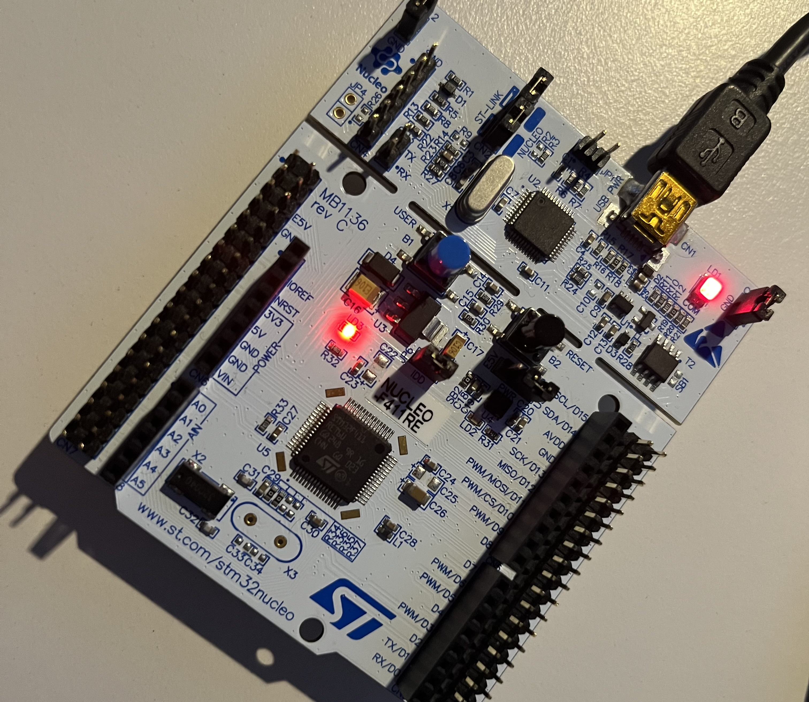
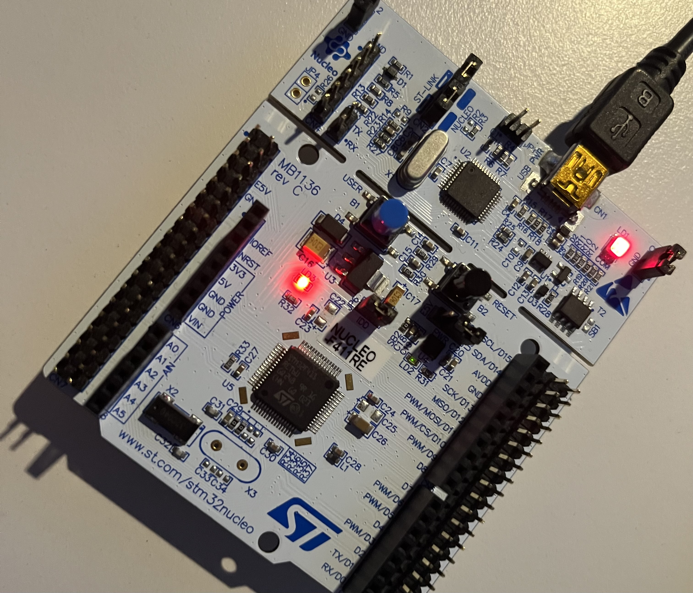
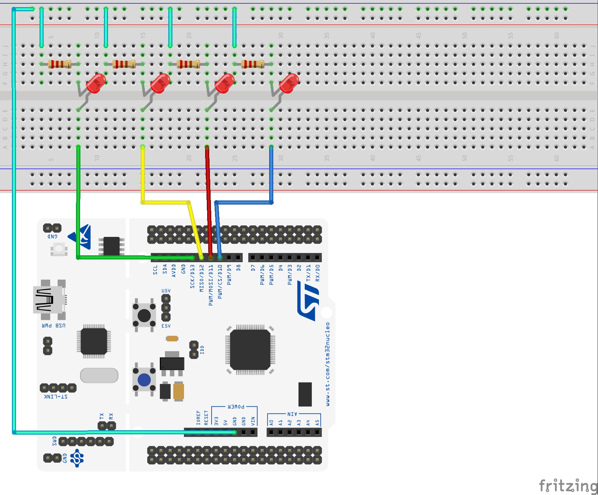
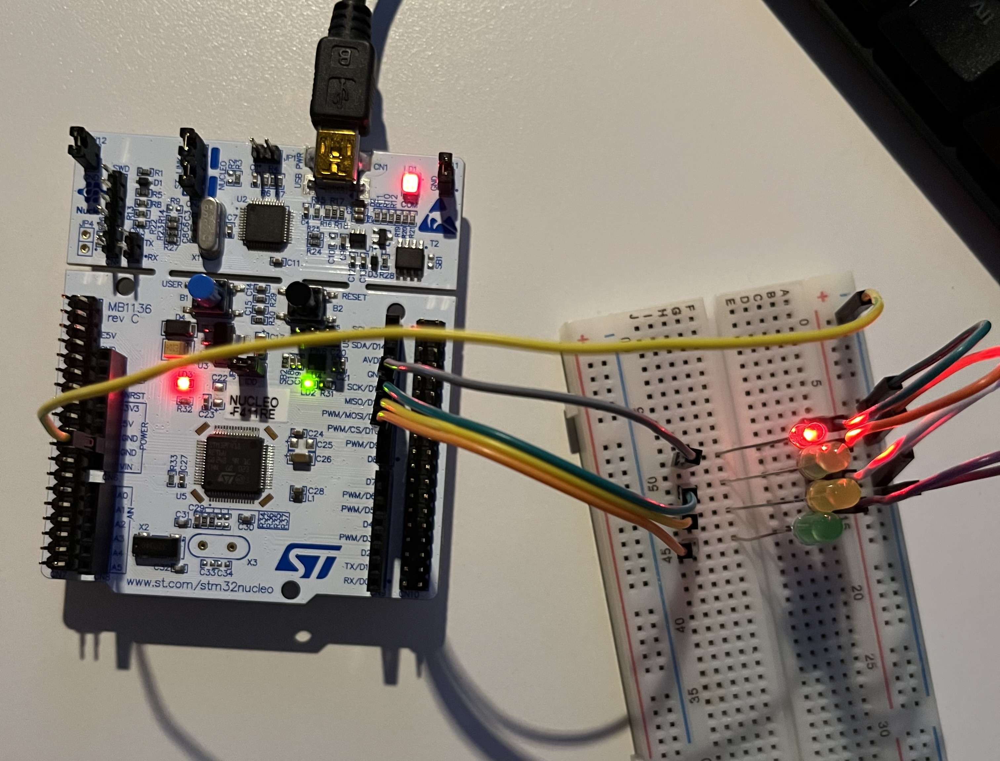
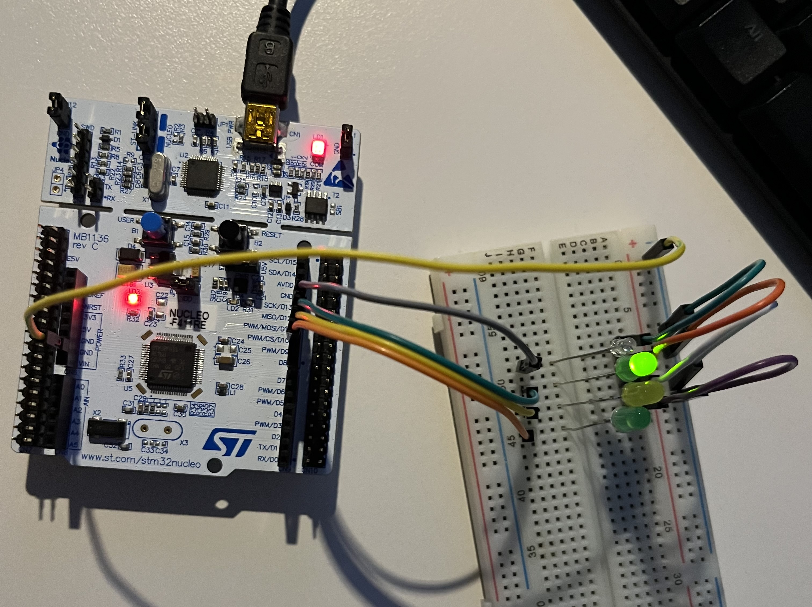
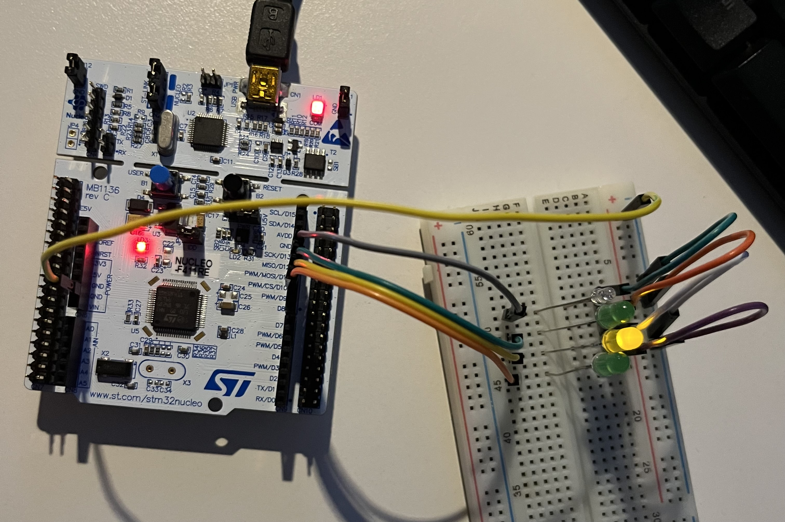
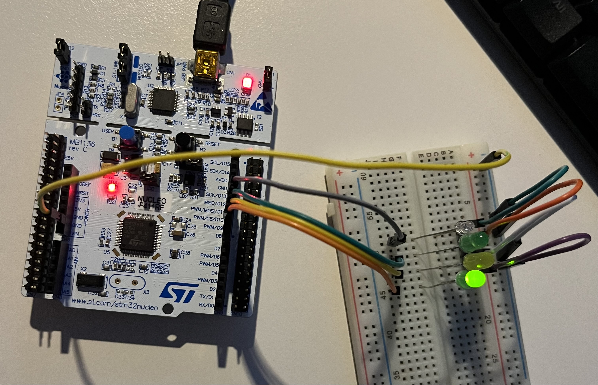

# **LAB: GPIO Digital InOut**

**Date:** 2024-09-18

**Author/Partner:** Hee-Won Kim

**Github:** repository link

**Demo Video:** [PROBLEM 2](https://youtu.be/dBpTmBGsslo?si=eWhd61T4cr8Vwhls), [PROBLEM 3](https://youtu.be/FtCEHv_D8XM)

---

## **Introduction**

> In this lab, I will create a simple program that toggle multiple LEDs with a push-button input.

### **Requirement**

### **Hardware**

- MCU
    - NUCLEO-F411RE
- Actuator/Sensor/Others:
    - LEDs x 3
    - Resistor 330 ohm x 3, breadboard

### **Software**

- Keil uVision, CMSIS, EC_HAL library

---

## **Problem 1: Create EC_HAL library**

> I completed the existing functions and defined the states of OSPEED, OTYPE, and PUPD using enums for easier use.

```C
typedef enum {
    LOW_SPEED,
    MEDIUM_SPEED,
    FAST_SPEED,
    HIGH_SPEED,
}OSPEED_CONFIG;

typedef enum {
    PUSH_PULL,
    OPEN_DRAIN,
}OTYPE_CONFIG;

typedef enum {
    NO_PUPD,
    PULL_UP,
    PULL_DOWN,
    RESERVED,
}PUPD_CONFIG;
```

---

## **Problem 2: Toggle LED with Button**

### **Procedure**

> This problem shows toggling the LED by pushing the button.
>
> If the button is pushed while the LED is off, the LED will turn on, else if the button is pushed while the LED is on, the LED will turn off. And this repeats.

<br>

### **Configuration**

| Button (B1) | LED |
| --- | --- |
| Digital In | Digital Out |
| GPIOC, Pin 13 | GPIOA, Pin 5 |
| PULL-UP | Open-Drain, Pull-up, Medium Speed |

<br>

### **My Code**

```C
/*
******************************************************************************
* @author  Hee-Won Kim
* @Mod	   2024-09-19 by KHW0619
* @brief   Embedded Controller:  LAB_GPIO_DIO_LED
******************************************************************************
*/


#include "ecRCC2.h"
#include "ecGPIO2.h"

#define LED_PIN PA_5		// LED pin number
#define BUTTON_PIN PC_13	// button pin number

void setup(void);			// Initialiization
	
int main(void) { 
 	setup();
	int button_state = 0;
	int button_state_prev = 0;
	int output_state = LOW;
	int iter = 300;				// iteration for debouncing

	while(1){
		// software debouncing and read the button state
		for(int iter_count = 0; iter_count < iter; iter_count++){};
		button_state = GPIO_read(BUTTON_PIN);

		// check the button state change
		if(button_state_prev && !button_state) {
			// software debouncing and double-check the button state
			for(int iter_count = 0; iter_count < iter; iter_count++){};
			button_state = GPIO_read(BUTTON_PIN);

			// change LED pin's output state
			if(!button_state) output_state = !output_state;
		}

		GPIO_write(LED_PIN, output_state);
		button_state_prev = button_state;
	}
}

void setup(void) {
	RCC_HSI_init();
	GPIO_init(BUTTON_PIN, INPUT);
	GPIO_init(LED_PIN, OUTPUT);
	GPIO_otype(LED_PIN, OPEN_DRAIN);
	GPIO_pupd(LED_PIN, PULL_UP);
	GPIO_pupd(BUTTON_PIN, PULL_UP);
	GPIO_ospeed(LED_PIN, MEDIUM_SPEED);
}
```

### **Results**

|  LED off |  LED on |
|------------------------------------|-----------------------------------|

### **Discussion**

1. Find out a typical solution for software debouncing and hardware debouncing.

   > **software debouncing:** Software debouncing typically involves waiting for the signal to stabilize before reading the button state.
   > 
   > **hardware debouncing:** Hardware debouncing typically involves using a simple RC circuit to filter out high-frequency noise


2. What method of debouncing did this NUCLEO board use for the push-button(B1)?

   > The chosen method is waiting for the signal to stabilize before reading the button state, which is a software method. Implemented using a for loop with a fixed number of iterations.

## 

---

## **Problem 3: Toggle LED with Button**

### **Procedure**

> This problem shows how to turn on the four LEDs sequentially by pushing the button.
>
> The LEDs will turn on sequentially by pushing the button, in the order LED0 -> LED1 -> LED2 -> LED3 -> LED0... .

### **Configuration**

| Button | LED |
| --- | --- |
| Digital In | Digital Out |
| GPIOC, Pin 13 | PA5, PA6, PA7, PB6 |
| PULL-UP | Push-Pull, Pull-up, Medium Speed |

<br>

### **Circuit Diagram**



### **My Code**

```
/*
******************************************************************************
* @author  Hee-Won Kim
* @Mod	   2024-09-19 by KHW0619
* @brief   Embedded Controller:  LAB_GPIO_DIO_multiLED
******************************************************************************
*/

#include "ecRCC2.h"
#include "ecGPIO2.h"

#define BUTTON_PIN PC_13                            // LED pin number
PinName_t LED_PINS[4] = {PA_5, PA_6, PA_7, PB_6};   // button pin number

void setup(void);                                   // Initialiization

int main(void) {
    int button_state = 0;
    int button_state_prev = 0;
    int led_idx = 0;
    int iter = 300;

    setup();

    while(1){
        // software debouncing and read the button state
        for(int iter_count = 0; iter_count < iter; iter_count++){};
        button_state = GPIO_read(BUTTON_PIN);

        // check the button state change
        if(button_state_prev && !button_state) {
            // software debouncing and double-check the button state
            for(int iter_count = 0; iter_count < iter; iter_count++){};
            button_state = GPIO_read(BUTTON_PIN);

            // change LED pin's output state
            if(!button_state) led_idx++;
        }

        // turn off the previous state and turn on the current state
        GPIO_write(LED_PINS[(led_idx + 3) % 4], LOW);
        GPIO_write(LED_PINS[led_idx % 4], HIGH);

        // save the previous value
        button_state_prev = button_state;
    }
}

void setup(void) {
    RCC_HSI_init();
    GPIO_init(BUTTON_PIN, INPUT);
    for(int led_set_idx = 0; led_set_idx < 4; led_set_idx++) {
        GPIO_init(LED_PINS[led_set_idx], OUTPUT);
        GPIO_otype(LED_PINS[led_set_idx], PUSH_PULL);
        GPIO_pupd(LED_PINS[led_set_idx], PULL_UP);
        GPIO_ospeed(LED_PINS[led_set_idx], MEDIUM_SPEED);
    }
    GPIO_pupd(BUTTON_PIN, PULL_UP);

    // turn off the all LEDs
    for(int led_set_idx = 0; led_set_idx < 4; led_set_idx++) GPIO_write(LED_PINS[led_set_idx], LOW);
}
```

### **Results**

|  LED0 |  LED1 |
|----------------------------------------|----------------------------------------|
|  LED2 |  LED3 |


### **Discussion**

1. Find out a typical solution for software debouncing and hardware debouncing. What method of debouncing did this NUCLEO board use for the push-button(B1)?


> **software debouncing:** Software debouncing typically involves waiting for the signal to stabilize before reading the button state.
>
> **hardware debouncing:** Hardware debouncing typically involves using a simple RC circuit to filter out high-frequency noise

> The chosen method is waiting for the signal to stabilize before reading the button state, which is a software method. Implemented using a for loop with a fixed number of iterations.

---

## **Reference**

> Zhu, Y. (2018). Embedded systems with ARM Cortex-M microcontrollers in assembly language and C (3rd ed.). E-Man Press LLC.

