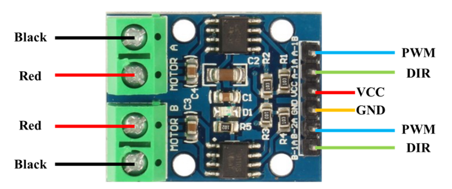

# **LAB: Timer & PWM**

> Servo motor and DC motor

**Date:** 2024-10-10

**Author/Partner:** Hee-Won Kim

**Github:** [https://github.com/KHW0619/Embedded-Controller/tree/master/LAB/LAB_PWM](https://github.com/KHW0619/Embedded-Controller/tree/master/LAB/LAB_PWM)

**Demo Video:** [PROBLEM1](https://youtu.be/8sHyCdwSkLk), [PROBLEM2](https://youtu.be/Vvxr0c5Cq2U)

---

## **Introduction**

> In this lab, a servo motor and a DC motor are controlled using PWM output.

### **Requirement**

### **Hardware**

- MCU
    - NUCLEO-F411RE
- Actuator/Sensor/Others:
    - 3 LEDs and load resistance
    - RC Servo Motor (SG90)
    - DC motor (5V)
    - DC motor driver(LS9110s)
    - breadboard

### **Software**

- Keil uVision, CMSIS, EC_HAL library

---

## **Problem 1: RC servo motor**

> In this problem, an RC servo motor rotates 10 degrees at a time from 0 to 180 degrees with a 500 msec period by using PWM duty. When it reaches the end points of 0 degrees or 180 degrees, it reverses direction and continues moving. The RC servo moter reaches 0 degree when the duty is 0.5/20 and reaches 180 degree when the duty is 2.5/20. Using that point, RC servo moter could be controlled.
> 
> And, when the button is pushed, motor will be reset as 0 degree.

### **1-1. Create HAL library**

**ecTIM2.h**

ecTIM2.h got below functions.

```
/* Timer Configuration */
///////  Step1:  Initialize  TIMERx
void TIM_init(TIM_TypeDef* TIMx, uint32_t msec);
// Default Setting:  TIM_period_ms(TIMx, 1 msec) with Counter_Clk 100kHz / PSC=840-1, ARR=100-1
// Previous version:  void TIM_init(TIM_TypeDef* TIMx, uint32_t msec);

///////  Step2:   Choose Timer Update Period  (a) msec or  (b) usec
void TIM_period(TIM_TypeDef* TIMx, uint32_t msec);    // msec of TimerUEV with Counter_Clk 100kHz / PSC=840, ARR=100*msec
void TIM_period_ms(TIM_TypeDef* TIMx, uint32_t msec);
void TIM_period_us(TIM_TypeDef* TIMx, uint32_t usec);  // usec of TimerUEV with Counter_Clk 1MHz / PSC=84, ARR=100*msec


/* Timer UI Interrupt Configuration */
///////  Step1:   Initialize TIM_UI with TIMERx
void TIM_UI_init(TIM_TypeDef* TIMx, uint32_t msec); 

///////  Step2:   Start by Enabling TIM_UI 
void TIM_UI_enable(TIM_TypeDef* TIMx);
void TIM_UI_disable(TIM_TypeDef* TIMx);

uint32_t is_UIF(TIM_TypeDef *TIMx);
void clear_UIF(TIM_TypeDef *TIMx);
```

**ecPWM2.h**

ecPWM2.h got below functions.

```
/* PWM initialization */
// Default: 84MHz PLL, 1MHz CK_CNT, 50% duty ratio, 1msec period
void PWM_init(PinName_t pinName);
void PWM_pinmap(PinName_t pinName, TIM_TypeDef **TIMx, int *chN);


/* PWM PERIOD SETUP */
// allowable range for msec:  1~2,000
void PWM_period(PinName_t pinName,  uint32_t msec);	
void PWM_period_ms(PinName_t pinName,  uint32_t msec);	// same as PWM_period()
// allowable range for usec:  1~1,000
void PWM_period_us(PinName_t pinName, uint32_t usec);


/* DUTY RATIO SETUP */
// High Pulse width in msec
void PWM_pulsewidth(PinName_t pinName, uint32_t pulse_width_ms);
void PWM_pulsewidth_ms(PinName_t pinName, uint32_t pulse_width_ms);  // same as void PWM_pulsewidth
// Duty ratio 0~1.0
void PWM_duty(PinName_t pinName, float duty);
```

### **Procedure**

1. The pins are set according to the configuration.
2. The angle of the RC servo motor increases from 0° to 180° in steps of 10° every 500 msec. After reaching 180°, the angle decreases back to 0°. Timer interrupt IRQ is used.
3. When the button is pressed, it resets to the angle 0° and starts over. EXT interrupt is used.

### **Configuration**

| Type | Port - Pin | Configuration |
| --- | --- | --- |
| **Button** | Digital In (PC13) | Pull-Up |
| **PWM Pin** | AF (PA1) | Push-Pull, Pull-Up, Fast |
| **PWM Timer** | TIM2_CH2 (PA1) | TIM2 (PWM) period: 20msec, Duty ratio: 0.5~2.5msec |
| **Timer Interrupt** | TIM3 | TIM3 Period: 1msec, Timer Interrupt of 500 msec |

### 

### **Circuit Diagram**


### **Discussion**

1. Derive a simple logic to calculate CRR and ARR values to generate x[Hz] and y[%] duty ratio of PWM. How can you read the values of input clock frequency and PSC?

    > The clock frequency for counter $ F_{ck\_cnt} $ is obtained by dividing the clock frequency for prescaler $ F_{ck\_psc} $ by $ PSC + 1 $. The PWM frequency is then derived by dividing the timer frequency by $ ARR + 1 $, which means the counter resets when it reaches the ARR value.
    > 
    > The equation is as follows:
    $$ F_{ck\_cnt} = \frac{F_{ck\_psc}}{PSC + 1} $$
    $$ F_{PWM} = \frac{F_{ck\_cnt}}{ARR + 1} $$
    $$ ∴  F_{PWM} = \frac{F_{ck\_psc}}{(PSC + 1) * (ARR + 1)}$$

   2. What is the smallest and highest PWM frequency that can be generated for Q1?
    
    > First of all, assuming that $ F_{ck\_psc} $ is fixed at 84MHz.
    > 
    >    smallest PWM frequency: PSC and ARR values should be the highest value. In the reference manual, It shows PSC[15:0]: Prescaler value and ARR[15:0]: Auto-reload value. So, The highest value is 0b1111 1111 1111 1111 (= 0xFFFF = 65535) both PSC and ARR. When the value is input, it will be as follows.
    >
    >    $$ F_{PWM} = \frac{F_{ck\_psc}}{(PSC + 1) * (ARR + 1)}$$
        $$  F_{PWM} = \frac{F_{ck\_psc}}{(65535 + 1) * (65535 + 1)}$$
        $$ ∴  F_{PWM} = 0.0196 [Hz]$$
        highest PWM frequency: PSC and ARR values should be the smallest value. So, The smallest value is 0b0000 (= 0x0 = 0) both PSC and ARR. When the value is input, it will be as follows.
    >
    >    $$  F_{PWM} = \frac{F_{ck\_psc}}{(PSC + 1) * (ARR + 1)}$$
        $$  F_{PWM} = \frac{F_{ck\_psc}}{(0 + 1) * (0 + 1)}$$
        $$  F_{PWM} = 84 [MHz] $$

### **My Code**

> In the setup(void) function, the initial values of the pins are configured along with other settings such as the configuration.
>
> The TIM3_IRQHandler(void) rotates the motor by 10 degrees at each interval defined in the configuration. The motor's direction is determined by the direction variable, which is set to 1 when moving from 0 degrees to 180 degrees and -1 when moving from 180 degrees to 0 degrees. The direction changes when the motor reaches 0 degrees or 180 degrees. The step size for each 10-degree movement is defined using the signal_strength variable, which is calculated based on a duty cycle of 0.5 ms at 0 degrees and 2.5 ms at 180 degrees.
>
> The EXTI15_10_IRQHandler(void) resets the motor's state to 0 degrees.

```
/*
******************************************************************************
* @author  Hee-Won Kim
* @Mod	   2024-10-09 by KHW0619
* @brief   Embedded Controller:  LAB_PWM_RCmotor
******************************************************************************
*/

#include "ecSTM32F4v2.h"

#define BUTTON_PIN	PC_13
#define PWM_PIN PA_1

void setup(void);

int main(void) {
    // Initialization --------------------------------------------------
    setup();

    // Infinite Loop ---------------------------------------------------
    while(1){}
}


// Initialization
void setup(void){
    // System Clock = 84MHz
    RCC_PLL_init();

    // SysTick init
    SysTick_init();

    // BUTTON_PIN setting INPUT, PULL_UP
    GPIO_init(BUTTON_PIN, INPUT);
    GPIO_otype(BUTTON_PIN, PULL_UP);

    // PWM_PIN setting 20ms period
    PWM_init(PWM_PIN);
    PWM_period(PWM_PIN, 20);

    // TIM3 setting 500ms period
    TIM_UI_init(TIM3, 500);
    TIM_UI_enable(TIM3);

    EXTI_init(BUTTON_PIN, FALL, 0);
}

// motor rotation interval
float signal_strength = (2.5 - 0.5)/18.0;

// motor state num
int duty_count = 0;

// variable for motor rotation direction
uint32_t direction = 1;

void TIM3_IRQHandler(void) {
    // Check TIM3 UIF
    if(is_UIF(TIM3)){
        PWM_duty(PWM_PIN, (float)(signal_strength * duty_count + 0.5)/20.0);

        // chane the motor state
        duty_count += direction;

        // change the direction
        if(duty_count > 17 || duty_count < 1) direction*= -1;

        // Clear TIM3 UIF
        clear_UIF(TIM3);
    }
}

void EXTI15_10_IRQHandler(void) {
    // Check BUTTON_PIN's pending
    if (is_pending_EXTI(BUTTON_PIN)) {

        // reset the motor state
        duty_count = 0;
        direction = 1;

        // Clear BUTTON_PIN's pending
        clear_pending_EXTI(BUTTON_PIN);
    }
}
```

### **Results**

> As a result, it was confirmed that the servo motor rotates by 10 degrees every 500 ms. It was also confirmed that the motor resets to 0 degrees when the BUTTON_PIN is pressed.

Experiment Circuit Image


Experiment Result Image (The images are arranged in sequential order.)

|  0 [deg]     |  10 [deg]    |  20 [deg]    |  30 [deg]    |
|-----------------------------------------------|-----------------------------------------------|-----------------------------------------------|-----------------------------------------------|
|  40 [deg]    |  50 [deg]    |  60 [deg]    |  70 [deg]    |
|  80 [deg]    |  90 [deg]    |  100 [deg]  |  110 [deg] |
|  120 [deg] |  130 [deg] |  140 [deg] |  150 [deg] |
|  160 [deg] |  170 [deg] |  180 [deg] |  170 [deg] |
|  160 [deg] |  150 [deg] |  140 [deg] |  130 [deg] |
|  120 [deg] |  110 [deg] |  100 [deg] |  90 [deg]  |
|  80 [deg]  |  70 [deg]  |  60 [deg]  |  50 [deg]  |
|  40 [deg]  |  30 [deg]  |  20 [deg]  |  10 [deg]  |
|  0 [deg]   |   |   |   |


|  before button pressed |  button pressed |  after button pressed |
|-----------------------------------------------------------------------------------------|--------------------------------------------------------------|----------------------------------------------------------------------------------------|

---

## **Problem 2: DC motor**

> In this problem, a DC motor will switch between a duty cycle of 25% and 75%, alternating every 2 seconds. The BUTTON_PIN is used to control whether the motor operates or stops.

> Used motor driver
> 

| DIR  | Duty ratio: 0 -> 1 | Direction |
|------|--------------------|-----------|
| LOW  | Velocity increase  | CR        |
| HIGH | Velocity decrease  | CCR       |

### **Procedure**

1. Connect the DC motor and the DC motor driver.
   - PA_0 is used for the DC motor PWM. 
   - PC_2 is used for the Direction Pin.
2. The DC motor changes from LOW speed to HIGH speed every 2 seconds.
   - For example, 25% → 75% → 25% → and so on.
3. When the button is pressed, it pauses or continues the motor run.

### **Configuration**

| Function | Port - Pin | Configuration |
| --- | --- | --- |
| **Button** | Digital In (PC13) | Pull-Up |
| **Direction Pin** | Digital Out (PC2) | Push-Pull |
| **PWM Pin** | AF (PA0) | Push-Pull, Pull-Up, Fast |
| **PWM Timer** | TIM2_CH1 (PA0) | TIM2 (PWM) period: **1msec (1kHz)** |
| **Timer Interrupt** | TIM3 | TIM3 Period: 1msec, Timer Interrupt of 500 msec |

### **Circuit Diagram**


### **My Code**

> In the setup(void) function, the initial values of the pins are configured along with other settings such as the configuration.
> 
> The TIM3_IRQHandler(void) is used to change the motor speed at 2-second intervals. With an initial setting of a 500 ms period for TIM3, the code is executed after repeating the period four times to achieve a total of 2 seconds. The speed is controlled using the variable signal_strength, which is modified using XOR to change its value.
> 
> The EXTI15_10_IRQHandler(void) is used so that when the button is pressed, the stop_flag is toggled using XOR, allowing the motor to stop when it is running and start when it is stopped. When stopping, the duty value is set to DIR_value, ensuring that the code functions regardless of the motor's direction.

```
/*
******************************************************************************
* @author  Hee-Won Kim
* @Mod	   2024-10-10 by KHW0619
* @brief   Embedded Controller:  LAB_PWM_DCmotor
******************************************************************************
*/

#include "ecSTM32F4v2.h"

#define BUTTON_PIN PC_13
#define PWM_PIN PA_0
#define DIR_PIN PC_2

void setup(void);

int main(void) {
    // Initialization --------------------------------------------------
    setup();

    // Infinite Loop ---------------------------------------------------
    while(1){}
}

int DIR_value = LOW;

// Initialization
void setup(void){
    RCC_PLL_init();				// System Clock = 84MHz
    SysTick_init();

    GPIO_init(BUTTON_PIN, INPUT);
    GPIO_otype(BUTTON_PIN, PULL_UP);

    GPIO_init(DIR_PIN, OUTPUT);
    GPIO_otype(DIR_PIN, PUSH_PULL);
    GPIO_write(DIR_PIN, DIR_value);

    PWM_init(PWM_PIN);
    PWM_period(PWM_PIN, 1);

    TIM_UI_init(TIM3, 500);
    TIM_UI_enable(TIM3);

    EXTI_init(BUTTON_PIN, FALL, 0);
}

// counter for 2sec period
int count = 0;

// motor rotation velocity
int signal_strength = 0;

//
static int stop_flag = 0;
float duty_value = 0.0;

void TIM3_IRQHandler(void) {
    // counting the period
    count++;
        
    // Check TIM3 UIF
    if(is_UIF(TIM3)){
        // making 2sec period
        if(count > 3) {
            // reset counter
            count = 0;

            // when the stop_flag is not set, the duty value
            if(!stop_flag) duty_value = (0.25 + 0.5 * signal_strength);

            // set PWM
            PWM_duty(PWM_PIN,  duty_value);

            // change the motor rotation velocity
            signal_strength ^= 1;
        }

        // Clear TIM3 UIF
        clear_UIF(TIM3);
    }
}


void EXTI15_10_IRQHandler(void) {
    for(int i = 0; i < 500000;i++){}  // delay_ms(500);
    unsigned int button_state = GPIO_read(BUTTON_PIN);

    if (is_pending_EXTI(BUTTON_PIN) && !button_state) {
        for(int i = 0; i < 500000; i++) {};
        button_state = GPIO_read(BUTTON_PIN);

        if(!button_state) {
            // change motor's rotation state
            stop_flag ^= 1;

            // when the stop_flag is set, the duty value
            duty_value = DIR_value;

            // when the stop_flag is not set, the duty value
            if(!stop_flag) duty_value = (0.25 + 0.5 * signal_strength);

            // set PWM
            PWM_duty(PWM_PIN,  duty_value);
        }
        // Clear BUTTON_PIN's pending
        clear_pending_EXTI(BUTTON_PIN);
    }
}
```

### **Results**

> As a result, it was confirmed that the motor's speed changes at 2-second intervals, and when the BUTTON_PIN is pressed during operation, the motor stops. When the BUTTON_PIN is pressed again while stopped, the motor resumes operation.

Experiment Circuit Image


Experiment Result Image

|  fast speed |  slow speed |  stop<br/>(when the BUTTON_PIN is pressed) |
|----------------------------------------------------|--------------------------------------------------------------|------------------------------------------------------------------------------|

---

### **Reference**

> Zhu, Y. (2018). Embedded systems with ARM Cortex-M microcontrollers in assembly language and C (3rd ed.). E-Man Press LLC.

---
