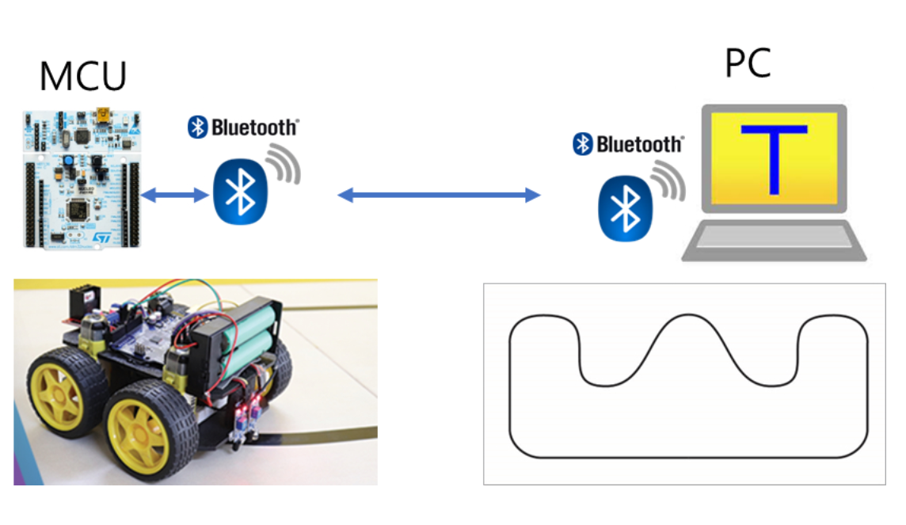
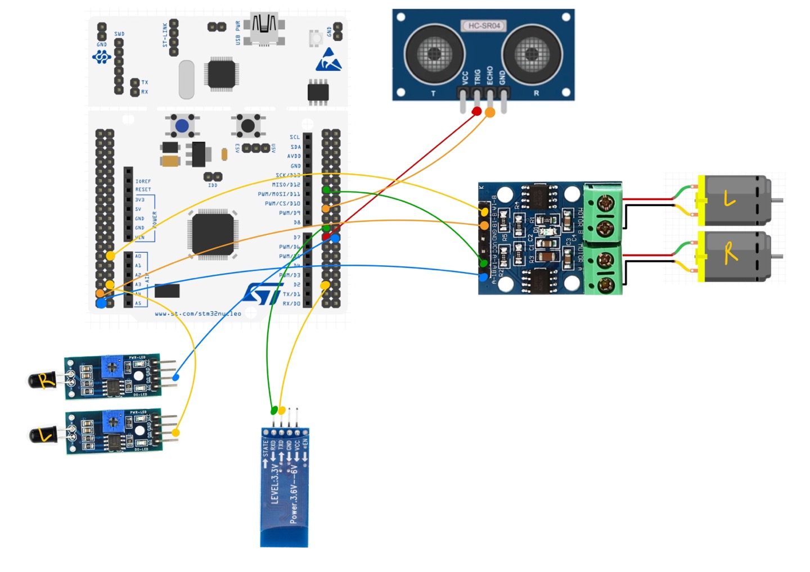
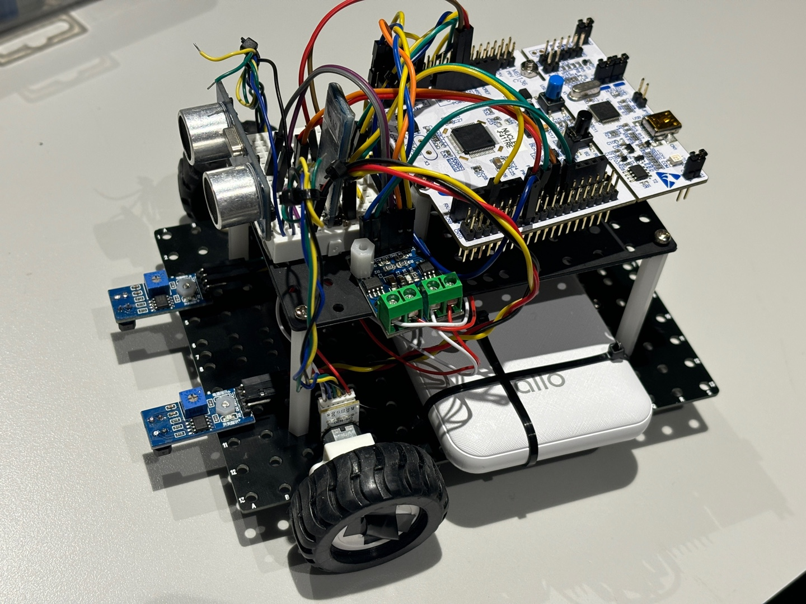
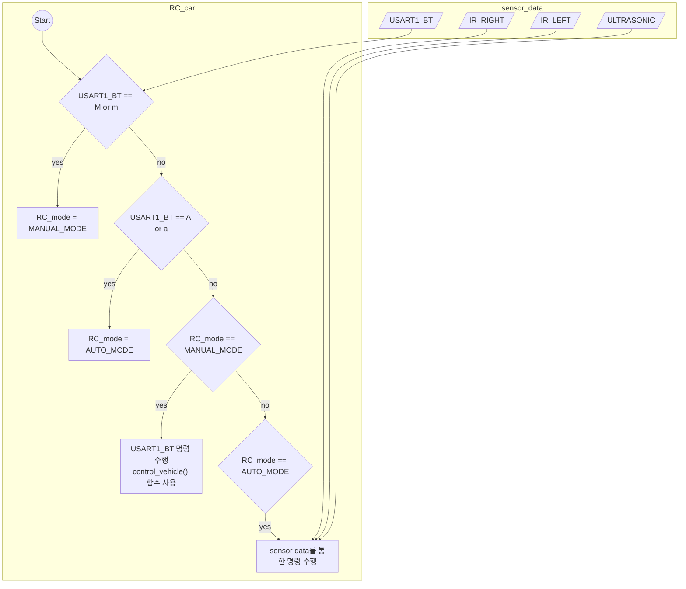

# LAB: Line Tracing RC Car

**Date:** 2024-11-16

**Author/Partner:** Yuha Park & Heewon Kim

**Github:** [https://github.com/KHW0619/Embedded-Controller/tree/master/LAB/LAB_RCcar](https://github.com/KHW0619/Embedded-Controller/tree/master/LAB/LAB_RCcar)

**Demo Video:** [RCcar_Auto_mode test video](https://youtu.be/npX0aMinxLI), [RCcar_Manual_mode test video](https://youtu.be/XliCU_yTtSo)

## Introduction

Design an embedded system to control an RC car to drive on the racing track. The car is controlled either manually with wireless communication or automatically to drive around the track. When it sees an obstacle on the driving path, it should temporarily stop until the obstacle is out of the path.

> There can be more missions to complete.



### Requirement

#### Hardware

- MCU
  - NUCLEO-F411RE
- Actuator/Sensor/Others: Minimum
  - Bluetooth Module(HC-06)
  - DC motor x2, DC motor driver(L9110s)
  - IR Reflective Sensor (TCRT 5000) x2
  - HC-SR04
  - additional sensor/actuators are acceptable

#### Software

- Keil uVision, CMSIS, EC_HAL library

## Preparation

### LABS:

You should review previous labs for help

1. LAB: ADC IR Sensor
2. LAB: USART Bluetooth
3. LAB: Timer & PWM

## Problem Definition

Design your RC car that has the following functions:

1. Line tracing on the given racing track
2. has 2 control modes: **Manual Mode** to **AUTO Mode**
3. stops temporally when it detects an object nearby on the driving path

On the PC, connected to MCU via bluetooth

- Print the car status every 1 sec such as “ ( “ MOD: A DIR: F STR: 00 VEL: 00 ”)

### Manual Mode

- Mode Change( MOD):
  - When 'M' or 'm' is pressed, it should enter **Manual Mode**
  - LD2 should be ON in Manual Mode
- Speed (VEL):
  - Increase or decrease speed each time you push the arrow key “UP” or “DOWN”, respectively.
  - You can choose the speed keys
  - Choose the speed level: V0 ~ V3
- Steer (STR):
  - Steering control with keyboard keys
  - Increase or decrease the steering angles each time you press the arrow key “RIGHT” or “LEFT”, respectively.
  - Steer angles with 3 levels for both sides: e.g: -3, -2, -1, 0, 1, 2, 3 // '-' angle is turning to left
- Driving Direction (DIR)
  - Driving direction is forward or backward by pressing the key “F” or “B”, respectively.
  - You can choose the control keys
- Emergency Stop
  - RC car must stop running when key “S” is pressed.

### Automatic Mode

- Mode Change:
  - When 'A' or 'a' is pressed, it should enter **AUTO Mode**
- LD2 should blink at 1 second rate in AUTO Mode
- It should drive on the racing track continuously
- Stops temporally when it detects an object nearby on the driving path
- If the obstacle is removed, it should drive continuously

## Procedure

1. Discuss with the teammate how to design an algorithm for this problem

2. In the report, you need to explain concisely how your system works with state tables/diagram or flow-chart.

   ● Listing all necessary states (states, input, output etc) to implement this design problem.

   ● Listing all necessary conditional FLAGS for programming.

   ● Showing the logic flow from the initialization

   and more

3. Select appropriate configurations for the design problem. Fill in the table.

### Configuration

| **Functions**    | **Register** | **PORT_PIN** | **Configuration** |
| ---------------- | ------------ | ------------ | ----------------- |
| System Clock     | RCC          |              | PLL 84MHz         |
| delay_ms         | SysTick      |              |                   |
| Digital Out: LD2 |              | PA_5         |                   |

**Motor**

| **Functions**         | **Register**   | **PORT_PIN** | **Configuration**                               |
| --------------------- | -------------- | ------------ | ----------------------------------------------- |
| Motor DIR pin (Left)  | Digital Out    | PC_2         | Push_Pull00                                     |
| Motor DIR pin (Right) | Digital Out    | PC_3         | Push_Pull00                                     |
|                       |                |              |                                                 |
| PWM TIMER             | PWM (TIM2_CH1) | PA_0         | TIM2 (PWM) period: 20msec                       |
|                       | PWM (TIM3_CH1) | PA_6         | TIM3 (PWM) period: 20msec                       |
|                       |                |              |                                                 |
| Motor PWM pin (Left)  | PWM1           | PA_0         | AF, Push_Pull, No Pull-up Pull-down, Fast Speed |
| Motor PWM pin (Right) | PWM2           | PA_6         | AF, Push_Pull, No Pull-up Pull-down, Fast Speed |

**USART**

| **Functions**             | **Register** | **PORT_PIN**        | **Configuration**                                       |
| ------------------------- | ------------ | ------------------- | ------------------------------------------------------- |
| RS-232 USB cable(ST-LINK) | USART2       |                     | No Parity, 8-bit Data, 1-bit Stop bit 38400 baud-rate00 |
| Bluetooth                 | USART1       | TXD: PA9, RXD: PA10 | No Parity, 8-bit Data, 1-bit Stop bit 9600 baud-rate00  |

**Input Capture - Ultrasonic**

| **Functions** | **Register**        | **PORT_PIN**   | **Configuration**                                            |
| ------------- | ------------------- | -------------- | ------------------------------------------------------------ |
| ICAP          | PWM(TRIG)           | PA_8(TIM1_CH1) | AF, Push-Pull, No Pull-up Pull-down, Fast Speed              |
|               | TIM1                | PA_8(TIM1_CH1) | PWM of 50ms period / PWM pulse width of 10us                 |
| ICAP          | Input Capture(ECHO) | PB_6(TIM4_CH1) | AF, Push-Pull, No Pull-up Pull-down                          |
|               | TIM4                | PB_6(TIM4_CH1) | ICAP counter step time as 10us / TIM4_CH1 as IC1 , rising edge detect / TIM4_CH2 as IC2 , falling edge detect |

**JADC (IR)**

| **Functions** | **Register** | **PORT_PIN** | **Configuration**                                            |
| ------------- | ------------ | ------------ | ------------------------------------------------------------ |
| GPIO          | GPIOB        | PB_0, PB_1   | Analog Mode No Pull-up Pull-down                             |
| JADC          | JADC1        | PB_0, PB_1   | ADC Clock Prescaler /8 12-bit resolution, right alignment Continuous Conversion mode Scan mode: Two channels in regular group External Trigger (Timer5 Trigger) @ 1kHz Trigger Detection on Rising Edge |

### Circuit Diagram





### Flow Chart



### Header code

**ecRCcar.h**

```c++
#ifndef ECRCCAR_H
#define ECRCCAR_H

// Define RC Car control modes and settings
#define MANUAL_MODE      'M'
#define AUTO_MODE        'A'
#define SPEED_INCREASE   'U'
#define SPEED_DECREASE   'D'
#define STEER_RIGHT      'R'
#define STEER_LEFT       'L'
#define FORWARD          'F'
#define BACKWARD         'B'
#define EMERGENCY_STOP   'S'
#define ALP_SMALL        (char) (32)

#define MODE_M 0
#define MODE_A 1

#define LEFT  0
#define RIGHT 1
#define LED_PIN PA_5

#define MAX_SPEED 4
#define MID_SPEED 2.5
#define MIN_SPEED 1

#define TRIG    PA_8 
#define ECHO    PB_6 
#define TXD_PIN PA_9
#define RXD_PIN PA_10

#define VELOCITY_RATIO 0.2
#define STEER_INIT (int)(3)

#define STOP_DISTANCE   (float)( 15.0 )
#define IR_THRESHOLD    (float)(1000.0)
#define DISTANCE_BUFFER_SIZE 5 

#define AUTO_STRAIGHT    (int)(5)
#define AUTO_STEER_LEFT  (int)(3)
#define AUTO_STEER_RIGHT (int)(3)

#define SPECIFIC_KEY_A 'A'
#define SPECIFIC_KEY_B 'B'
#define SPECIFIC_KEY_C 'C'
#define SPECIFIC_KEY_D 'D'

#define ICAP_MIN_STOP_NUM 5

#endif //ECRCCAR_H

```

**Code Explanation**

> `LEFT`, `RIGHT`: Variables indicating the left and right direction of the RCcar. In the array consisting of 2 pins, index 0 is set to the left pin and index 1 is set to the right pin.

> `VELOCITY_RATIO`: The rate at which PWM increases and decreases in the DC motor.

> `STEER_INIT`: Indicates the initial steering state, and index 3 is set to the middle of the steering array that separates straight.

> `MAX_SPEED`, `MID_SPEED`, `MIN_SPEED`: Indicates the maximum, middle, and minimum speeds of the RCcar. It is used together with `VELOCITY_RATIO`, and the PWM of the wheel is expressed as the product of `VELOCITY_RATIO` and `000_SPEED`.

> `STOP_DISTANCE`: When the RCcar receives a value through the ultrasonic sensor, it stops if the distance is less than 15cm.

> `IR_THRESHOLD`: The IR sensor is adjusted based on the difference in light reflection between the white and black colors on the floor. Normally, black is 3000 and white is 380, so the distinction is set to `IR_THRESHOLD` = 1000.

> `AUTO_STRAIGHT`: In AUTO mode, when driving straight, `AUTO_STRAIGHT` = 5 is set. Then, the PWM of the wheel is expressed as `AUTO_STRAIGHT` * `VELOCITY_RATIO`.

> `AUTO_STEER_LEFT`, `AUTO_STEER_RIGHT`: Define the basic rotation value of the left and right steering in automatic mode. Each value is set to 3.

> `SPECIFIC_KEY_A`, `SPECIFIC_KEY_B`, `SPECIFIC_KEY_C`, `SPECIFIC_KEY_D`: These represent the arrow keys and are defined as ‘A’, ‘B’, ‘C’, and ‘D’.

> `ICAP_MIN_STOP_NUM`: This represents the minimum number of captures used for the stop condition and is set to `5`.


### Main Code

```c++
which#include "ecSTM32F4v2.h"
#include "math.h"
#include "ecRCcar.h"

// DC motor-----------------------------------------------------
PinName_t PWM_PIN[2] = {PA_0, PA_6}; // PWM output pins
PinName_t DIR_PIN[2] = {PC_2, PC_3}; // Direction control pins
float PWM_value[2] = { 1.0, 0.0 }; 	 // Initial PWM duty cycle for LEFT and RIGHT motors
uint32_t DIR_value = 1;  			 // Motor direction: 1(forward) or 0(backward)

volatile uint8_t RC_mode = 1;		 // 1: Manual Mode, 0: Auto Mode
volatile uint8_t RC_stop_flag = 0;	 // Flag to indicate an emergency stop

// IR------------------------------------------------------------
PinName_t IR_PIN[2] = {PB_0, PB_1};	 // IR sensor input pins
uint32_t IR_value[2] = { 0, 0 };	 // Values read from the IR sensors

//Input Capture-Ultrasonic---------------------------------------
float ICAP_time1 = 0;                // Time of rising edge capture
float ICAP_time2 = 0;                // Time of falling edge capture
float ICAP_distance = 0;             // Calculated distance in cm
float ICAP_timeInterval = 0;         // Duration of echo pulse in ms
uint32_t ICAP_ovf_cnt = 0;           // Overflow count for the timer

//Want to STOP using Ultrasonic
int ICAP_Large_State = 0;            // Count of consecutive large distance readings
int ICAP_Small_State = 0;            // Count of consecutive small distance readings

// USART - bluetooth--------------------------------------------------
static volatile uint8_t PC_Data = 0; // Data received from the PC
static volatile uint8_t BT_Data = 0; // Data received from the Bluetooth module

int velocity_state = 0;				 // Current speed level (e.g., V0-V3)
float PWM_SteerState[7][2] = {{0.4, 1.0}, {0.4, 0.8}, {0.2, 0.4}, {0.0, 0.0}, {0.4, 0.2}, {0.8, 0.4}, {1.0, 0.4}};			   					 // PWM values for different steering states
int PreessedNum = STEER_INIT;        // Current steering state (0 to 6) from float PWM_SteerState[7][2]. STEER_INIT is 3 that means car is going straight 

int ICAP_stop_flag = 0;              // Flag to handle ultrasonic-based stopping

/*------------Print STR-------------*/
char BT_string[50] = {0};            // String buffer for transmitting status
char STR_Print = '0';                // Initial steering state as a character

// Function to convert steering state to a character for display
char STR_Print_Func(void){			 
   if(PreessedNum < STEER_INIT) STR_Print = 'L'; 		// Left steering
   else if(PreessedNum > STEER_INIT) STR_Print = 'R';	// Right steering
   else STR_Print = 'C';								// Centered steering
   return STR_Print;
}
/*-----------End Print STR-----------*/

void setup(void);
void control_vehicle(char cmd); 	 // Handle vehicle control commands

int main(void){

    setup();
    while(1){
			 STR_Print_Func();				// Update steering state for display
			 sprintf(BT_string, "MOD: %d, DIR:%d, STR: %c, VEL: %d\r\n", RC_mode, DIR_value, STR_Print, velocity_state);							
			 USART1_write(BT_string, 50);		// Send status over Bluetooth
       		 delay_ms(1000);					// Print the car status every 1 sec
			 
       if (RC_mode) GPIO_write(LED_PIN, HIGH);   // LED ON in Manual Mode
       else LED_toggle();                        // LED toggle in Auto Mode
    }
}

void control_vehicle(char cmd) {
   switch (cmd) {
      case MANUAL_MODE:
      case MANUAL_MODE + ALP_SMALL:
         RC_mode = 1;
      break;

      case AUTO_MODE:
      case AUTO_MODE + ALP_SMALL:
         RC_mode = 0;
      break;

      case SPEED_INCREASE:
      case SPEED_INCREASE + ALP_SMALL:
         velocity_state++;
         if (velocity_state > MAX_SPEED) velocity_state = MAX_SPEED;
         PWM_value[LEFT]  = fabs(DIR_value - velocity_state * VELOCITY_RATIO);
         PWM_value[RIGHT] = fabs((1-DIR_value)- velocity_state * VELOCITY_RATIO);
      break;

      case SPEED_DECREASE:
      case SPEED_DECREASE + ALP_SMALL:
         velocity_state--;
         if (velocity_state < MIN_SPEED) velocity_state = MIN_SPEED;
         PWM_value[LEFT]  = fabs(DIR_value - velocity_state * VELOCITY_RATIO);
         PWM_value[RIGHT] = fabs((1-DIR_value) - velocity_state * VELOCITY_RATIO);
      break;

      case STEER_RIGHT:
      case STEER_RIGHT + ALP_SMALL:
         if(PreessedNum < 6) PreessedNum++;
         PWM_value[LEFT] = fabs(DIR_value - PWM_SteerState[PreessedNum][LEFT]);
         PWM_value[RIGHT] = fabs((1-DIR_value)- PWM_SteerState[PreessedNum][RIGHT]);

         if(PreessedNum == STEER_INIT) {
            PWM_value[LEFT]  = fabs(DIR_value - velocity_state * VELOCITY_RATIO);
            PWM_value[RIGHT] = fabs((1-DIR_value) - velocity_state * VELOCITY_RATIO);
         }
      break;

      case STEER_LEFT:
      case STEER_LEFT + ALP_SMALL:
         if(PreessedNum > 0) PreessedNum--;
         PWM_value[LEFT] = fabs(DIR_value - PWM_SteerState[PreessedNum][LEFT]);
         PWM_value[RIGHT] = fabs((1-DIR_value)-PWM_SteerState[PreessedNum][RIGHT]);

         if(PreessedNum == STEER_INIT) {
            PWM_value[LEFT]  = fabs(DIR_value - velocity_state * VELOCITY_RATIO);
            PWM_value[RIGHT] = fabs((1-DIR_value) - velocity_state * VELOCITY_RATIO);
         }
      break;

      case FORWARD:
      case FORWARD + ALP_SMALL:
					
					DIR_value = 1;
					velocity_state = 2;

					if(PreessedNum == STEER_INIT) {
            PWM_value[LEFT]  = fabs(DIR_value - velocity_state * VELOCITY_RATIO);
            PWM_value[RIGHT] = fabs((1-DIR_value) - velocity_state * VELOCITY_RATIO);
          }
					else{
						PWM_value[LEFT] = fabs(DIR_value - PWM_value[LEFT]);
						PWM_value[RIGHT] = fabs(DIR_value - PWM_value[RIGHT]);
					}
      break;

      case BACKWARD:
      case BACKWARD + ALP_SMALL:
					DIR_value = 0;
					velocity_state = 2;

					if(PreessedNum == STEER_INIT) {
            PWM_value[LEFT]  = fabs(DIR_value - velocity_state * VELOCITY_RATIO);
            PWM_value[RIGHT] = fabs((1-DIR_value) - velocity_state * VELOCITY_RATIO);
          }
					else{
						PWM_value[LEFT] = fabs((1-DIR_value) - PWM_value[LEFT]);
						PWM_value[RIGHT] = fabs((1-DIR_value) - PWM_value[RIGHT]);
					}
      break;

      case EMERGENCY_STOP: // Emergency Stop
      case EMERGENCY_STOP + ALP_SMALL:
         PWM_value[LEFT] = fabs((1-DIR_value) - 1);
         PWM_value[RIGHT] = fabs((1-DIR_value)- 0);
      break;

      default:
      break;
   }

   GPIO_write(DIR_PIN[LEFT], DIR_value);
   GPIO_write(DIR_PIN[RIGHT], DIR_value^1);
   PWM_duty(PWM_PIN[LEFT], PWM_value[LEFT]);
   PWM_duty(PWM_PIN[RIGHT], PWM_value[RIGHT]);
}

void USART1_IRQHandler(){       
    static int specific_key_state = 0;
    int specific_key = 0;
    if(is_USART1_RXNE()){
        BT_Data = USART1_read();      // RX from UART1 (BT)
        USART1_write(&BT_Data, 1);

        if(BT_Data == 27) specific_key_state = 1;
        else if(specific_key_state == 1) {
            if(BT_Data == 91) specific_key_state = 2;
            else specific_key_state = 0;
        }
        else if(specific_key_state == 2) {
            switch(BT_Data) {
                case SPECIFIC_KEY_A:
                   specific_key = 25;
                break;
                case SPECIFIC_KEY_B:
                   specific_key = 8;
                break;
                case SPECIFIC_KEY_C:
                    specific_key = 22;
                break;
                case SPECIFIC_KEY_D:
                    specific_key = 16;
                break;
                default:
                    specific_key_state = -1;
                break;
            }

            if(specific_key_state != -1) {
               BT_Data = 60 + specific_key;
               control_vehicle(BT_Data);
               specific_key_state = 0;
            }
        }
        else if(!specific_key_state) control_vehicle(BT_Data);
    }
}

void ADC_IRQHandler(void){
   if(is_ADC_OVR())
      clear_ADC_OVR();

   if(is_ADC_JEOC()){      // after finishing sequence
      IR_value[0] = JADC_read(1);
      IR_value[1] = JADC_read(2);
      clear_ADC_JEOC();
   }

   if(!RC_mode && !ICAP_stop_flag) {
      DIR_value = 1; //Do only Forward

      if(IR_value[LEFT] < IR_THRESHOLD && IR_value[RIGHT] < IR_THRESHOLD) {            // straight
				 PreessedNum = 3;
				 velocity_state = 5;
         PWM_value[LEFT]  = DIR_value - AUTO_STRAIGHT * VELOCITY_RATIO;
         PWM_value[RIGHT] = AUTO_STRAIGHT * VELOCITY_RATIO;
      }
      else if(IR_value[LEFT] > IR_THRESHOLD && IR_value[RIGHT] < IR_THRESHOLD) {         // turn left
				 PreessedNum = 2;
				 velocity_state = 4;
         PWM_value[LEFT]  = DIR_value - PWM_SteerState[STEER_INIT - AUTO_STEER_LEFT][LEFT];
         PWM_value[RIGHT] = PWM_SteerState[STEER_INIT - AUTO_STEER_LEFT][RIGHT];
      }
      else if(IR_value[LEFT] < IR_THRESHOLD && IR_value[RIGHT] > IR_THRESHOLD){         // turn right
				 PreessedNum = 4;
				 velocity_state = 4;
         PWM_value[LEFT]  = DIR_value - PWM_SteerState[STEER_INIT + AUTO_STEER_RIGHT][LEFT];
         PWM_value[RIGHT] = PWM_SteerState[STEER_INIT + AUTO_STEER_RIGHT][RIGHT];
      }
      else {
         PWM_value[LEFT]  = fabs((1-DIR_value) - 1);
         PWM_value[RIGHT] = fabs((1-DIR_value) - 0);
      }
   }

   GPIO_write(DIR_PIN[LEFT], DIR_value);
   GPIO_write(DIR_PIN[RIGHT], DIR_value ^ 1);
   PWM_duty(PWM_PIN[LEFT], PWM_value[LEFT]);
   PWM_duty(PWM_PIN[RIGHT], PWM_value[RIGHT]);
}

void TIM4_IRQHandler(void){
   if(is_UIF(TIM4)){                                                            // Update interrupt
      ICAP_ovf_cnt++;                                                           // overflow count
      clear_UIF(TIM4);                                                          // clear update interrupt flag
   }
   if(is_CCIF(TIM4, IC_1)){                                                     // TIM4_Ch1 (IC1) Capture Flag. Rising Edge Detect
      ICAP_time1 = ICAP_capture(TIM4, IC_1);                                    // Capture TimeStart
      clear_CCIF(TIM4, IC_1);                                                   // clear capture/compare interrupt flag
   }
   else if(is_CCIF(TIM4, IC_2)){                                                // TIM4_Ch2 (IC2) Capture Flag. Falling Edge Detect
      ICAP_time2 = ICAP_capture(TIM4, IC_2);                                    // Capture TimeEnd
      ICAP_timeInterval = ((ICAP_time2 - ICAP_time1) + ICAP_ovf_cnt * (TIM4->ARR + 1)) * 0.01;      
       									// (10us * counter pulse -> [msec] unit) Total time of echo pulse
      ICAP_ovf_cnt = 0;                                                         // overflow reset
      clear_CCIF(TIM4,IC_2);                                        // clear capture/compare interrupt flag
   }

   ICAP_distance = (float) ICAP_timeInterval * 340.0 / 2.0 / 10.0;

	 if (ICAP_distance > STOP_DISTANCE) {
       ICAP_Large_State++;
       ICAP_Small_State = 0;
   }
   else if (ICAP_distance <= STOP_DISTANCE) {
       ICAP_Small_State++;
       ICAP_Large_State = 0;
    }
	 
	 if (!RC_mode) { 
       if (ICAP_Small_State >= ICAP_MIN_STOP_NUM) { 
           DIR_value = 1;
           ICAP_stop_flag = 1;
           PWM_value[LEFT]  = fabs((1 - DIR_value) - 1);
           PWM_value[RIGHT] = fabs((1 - DIR_value) - 0);
       } 
       else if (ICAP_Large_State >= ICAP_MIN_STOP_NUM) { 
           ICAP_stop_flag = 0;
       }
   }
}

void USART2_IRQHandler(){               // USART2 RX Interrupt : Recommended
   if(is_USART2_RXNE()){
      PC_Data = USART2_read();          // RX from UART2 (PC)
      USART2_write(&PC_Data,1);         // TX to USART2  (PC)    Echo of keyboard typing
   }
}

void setup(void){
    RCC_PLL_init();
    SysTick_init();

   // =============================================================================================== //
   //                                                   Blue Tooth
   // =============================================================================================== //
    // USART2: USB serial init
    UART2_init();
    UART2_baud(BAUD_9600);

    // USART1: BT serial init
    UART1_init();
    UART1_baud(BAUD_9600);

   // =============================================================================================== //
    //                                                       IR
    // =============================================================================================== //
    // ADC Init  Default: HW triggered by TIM5 counter @ 1msec
    JADC_init(IR_PIN[0]);
    JADC_init(IR_PIN[1]);

    // ADC channel sequence setting
    JADC_sequence(IR_PIN, 2);

   // =============================================================================================== //
   //                                                      ICAP
   // =============================================================================================== //
    // PWM configuration
    PWM_init(TRIG);                        // PA_6: Ultrasonic trig pulse
    PWM_period_us(TRIG, 50000);            // PWM of 50ms period. Use period_us()
    PWM_pulsewidth_us(TRIG, 10);           // PWM pulse width of 10us

    // Input Capture configuration
    ICAP_init(ECHO);                       // PB_6 as input caputre
    ICAP_counter_us(ECHO, 10);             // ICAP counter step time as 10us
    ICAP_setup(ECHO, 1, IC_RISE);          // TIM4_CH1 as IC1 , rising edge detect
    ICAP_setup(ECHO, 2, IC_FALL);          // TIM4_CH2 as IC2 , falling edge detect

   // =============================================================================================== //
   //                                                     MOTOR
   // =============================================================================================== //
    for(int i = 0; i < 2; i++){
      GPIO_init(DIR_PIN[i], OUTPUT);
      GPIO_pupd(DIR_PIN[i], PUSH_PULL);

      PWM_init(PWM_PIN[i]);
      PWM_period_ms(PWM_PIN[i], 20);
    }

    GPIO_write(DIR_PIN[LEFT], DIR_value);       //SET DIR Pin Low(CW)
    GPIO_write(DIR_PIN[RIGHT], 1 - DIR_value);
    GPIO_init(PA_5, OUTPUT);

   PWM_duty(PWM_PIN[LEFT], 1);
   PWM_duty(PWM_PIN[RIGHT], 0);
}
```

### Code Explanation

- Differences in characteristics between left and right wheels

> PWM_value is determined by the difference between Direction and PWM, so `PWM_value` is the absolute value of `DIR - PWM`. Here, the DC motor of the right wheel becomes faster when `PWM_value` increases, and the DC motor of the left wheel becomes faster when `PWM_value` decreases.

- Function `control_vehicle`: This function changes the mode of the RC car or controls the speed, direction, steering, etc. according to the given command (`cmd`).

> - `case MANUAL_MODE`, `case MANUAL_MODE + ALP_SMALL`:

>
>Switch to manual mode. Set the `RC_mode` value to 1 to change the mode to manual.
>
>- `case AUTO_MODE`, `case AUTO_MODE + ALP_SMALL`:

>
>Switch to automatic mode. Set the `RC_mode` value to 0 to change the mode to automatic. >
>- `case SPEED_INCREASE`, `SPEED_INCREASE + ALP_SMALL`:
>
>Increase the vehicle speed by increasing the `velocity_state` value by 1. The speed is limited to not exceed `MAX_SPEED = 4`. The PWM values for the left and right wheels are calculated and adjusted to the new speed. Since `VELOCITY_RATIO` is `0.2`, it increases by `PWM = velocity_state * VELOCITY_RATIO` (0.2, 0.4, 0.6, 0.8).
>
>- `case SPEED_DECREASE`, `case SPEED_DECREASE + ALP_SMALL`:
>
>Decrease the vehicle speed by decreasing the `velocity_state` value by 1. The speed is limited to not exceed `MIN_SPEED = 1`. The PWM values for the left and right wheels are calculated and adjusted to the new speed. `VELOCITY_RATIO` is `0.2`, so it is reduced to `PWM = velocity_state * VELOCITY_RATIO` (0.8, 0.6, 0.4, 0.2).
>
>- `case STEER_RIGHT`, `case STEER_RIGHT + ALP_SMALL`:
>
>Set the vehicle to steer right. Change the steering value to right by increasing `PreessedNum` in the `PWM_SteerState[7][2]` array. Adjust the PWM value of the wheel according to the steering angle. Make sure `PreessedNum` is not more than 6.
>
>- `case STEER_LEFT`, `case STEER_LEFT + ALP_SMALL`:
>
>- Set the vehicle to steer left. Decrease `PreessedNum` in the `PWM_SteerState[7][2]` array to change the steering value to the left. Adjust the PWM value of the wheel according to the steering angle. Make sure `PreessedNum` does not go below 0.
>
>- `case FORWARD`, `case FORWARD + ALP_SMALL`:
>
>- Set `DIR_value = 1` to move forward. Set `velocity_state = 2` when initially press this button, so that the initial speed is 2. When in the straight state, it moves forward at the original speed, and when in the steering state, it moves forward in the original steering direction only.
>
>- `case BACKWARD`, `case BACKWARD + ALP_SMALL`:
>
>- Set `DIR_value = 0` to move backward. Set `velocity_state = 2` when initially press this button, so that the initial speed is 2. When in a straight state, it goes backwards at the original speed, and when in a steering state, it only goes backwards in the original steering direction.
>
>- `case EMERGENCY_STOP`, `case EMERGENCY_STOP + ALP_SMALL`:

>
>- Stop the vehicle immediately by setting all PWM values to 0.
>- **Calling `GPIO_write` and `PWM_duty`:
>- Set the direction and PWM values of the left and right wheels to finally control the movement of the vehicle.


- Function `USART1_IRQHandler`: This is an interrupt function that handles Bluetooth (UART1) communication.

> - Special key (directional key) processing:
> - The direction keys receive three numbers in a row. `27`, `91`, `(num)`. When `27` is input first, `specific_key_state = 1` becomes, and when `91` is input right away, `specific_key_state = 2` becomes. Then, it recognizes that it is a special key, and the last third number`(num)` determines which key it is. If a special key other than the left, right, up, and down arrow keys is entered, `specific_key_state = -1` is set. If `specific_key_state = -1` is not, `control_vehicle(BT_Data)` is executed. If it is not a special key, `control_vehicle(BT_Data)` is executed immediately.


- Function `ADC_IRQHandler`: This is a function that reads IR sensor data and determines vehicle operation in automatic driving mode.

> If `RC_mode` is automatic mode and `CAP_stop_flag = 0`, the vehicle is set to go straight, turn left, or turn right based on the IR sensor value.

>
>- Go straight
>
>If `IR_value` is received and the left and right values are less than `IR_THRESHOLD = 1000`, it is in a straight state, so the speed of the DC motor is set to `AUTO_STRAIGHT = 5`. 
>- LEFT
>
>When `IR_value` is received and the left value is greater than `IR_THRESHOLD` and the right value is less than `IR_THRESHOLD`, it should turn left.
>
>In the `PWM_SteerState[7][2]` array, set `PreessedNum = (STEER_INIT = 3) - (AUTO_STEER_LEFT = 3)`.
>
>- RIGHT
>
>When `IR_value` is received and the left value is less than `IR_THRESHOLD` and the right value is greater than `IR_THRESHOLD`, it should turn right.
>
>In the `PWM_SteerState[7][2]` array, set `PreessedNum = (STEER_INIT = 3) + (AUTO_STEER_LEFT = 3)`.
>
>- else
>
>In other cases, it stops. >
>- Call `GPIO_write` and `PWM_duty`:
>
>Set the direction and PWM value of the left and right wheels to finally control the movement of the vehicle.


- Function `TIM4_IRQHandler`: Processes Timer 4 interrupt and reads ultrasonic sensor data to perform distance calculation.

> If `ICAP_distance` exceeds `STOP_DISTANCE = 15`, increase `ICAP_Large_State` by 1 and initialize `ICAP_Small_State` to 0.
>
> If `ICAP_distance` is less than `STOP_DISTANCE = 15`, increase `ICAP_Small_State` by 1 and initialize `ICAP_Large_State` to 0.
>
> In AUTO mode, if `ICAP_Small_State` is `ICAP_MIN_STOP_NUM = 3` or more, it judges that there is an obstacle and stops. >
> If `ICAP_Large_State` is greater than `ICAP_MIN_STOP_NUM = 3`, it is determined that there is no obstacle and moves at the original speed.

## Results


#### RCcar Manual mode

> - Mode Change( MOD):
>   - When 'M' or 'm' is pressed, `MOD: 1`
>   - LD2 should be ON in Manual Mode
> - Speed (VEL):
>   - Increase or decrease speed each time you push the arrow key “UP” or “DOWN”, respectively.
>   - `VEL: 1~4`
> - Steer (STR):
>   - Increase or decrease the steering angles each time you press the arrow key “RIGHT” or “LEFT”, respectively.
>   - Steer angles with 3 levels for both sides: e.g: -3, -2, -1, 0, 1, 2, 3 // '-' angle is turning to left
>   - When the angle is turning to the right, `STR: R`
>   - When the angle is turning to the left, `STR: L`
> - Driving Direction (DIR)
>   - Driving direction is forward or backward by pressing the key “F” or “B”, respectively.
>   - If driving direction is forward, `DIR: 1`
>   - If driving direction is backward, `DIR: 0`
> - Emergency Stop
>   - RC car must stop running when key “S” is pressed.

[RCcar_Manual_mode test video](https://youtu.be/XliCU_yTtSo)

#### RCcar Auto mode

> - Mode Change:
>   - When 'A' or 'a' is pressed, it should enter **AUTO Mode**, `MOD: 0`
> - LD2 should blink at 1 second rate in AUTO Mode
> - It should drive on the racing track continuously
> - Stops temporally when it detects an object nearby on the driving path
> - If the obstacle is removed, it should drive continuously

[RCcar_Auto_mode test video](https://youtu.be/npX0aMinxLI)

## Reference

> Zhu, Y. (2018). Embedded systems with ARM Cortex-M microcontrollers in assembly language and C (3rd ed.). E-Man Press LLC.

