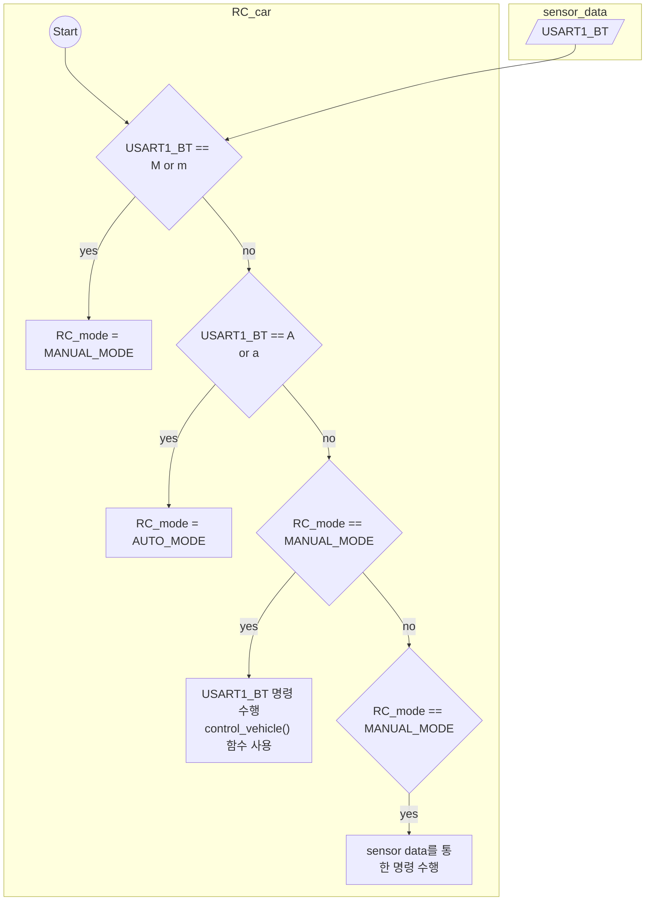

```mermaid
%%{init: {'theme': 'default', 'themeVariables': { 'fontSize': '24px' }}}%%
graph TD
    subgraph RC_car
        start((Start)) --> ifBTM{USART1_BT == M or m}

        ifBTM --> |yes| change_mode2m[RC_mode = MANUAL_MODE]
        ifBTM -->  |no| ifBTA{USART1_BT == A or a}

        ifBTA --> |yes| change_mode2a[RC_mode = AUTO_MODE]
        ifBTA -->  |no| ifRCM{RC_mode == MANUAL_MODE}

        ifRCM --> |yes| manual_mode["USART1_BT 명령 수행\ncontrol_vehicle() 함수 사용"]
        ifRCM -->  |no| ifRCA{RC_mode == MANUAL_MODE}
        
        ifRCA --> |yes| auto_mode["sensor data를 통한 명령 수행"]
    end
    
    subgraph sensor_data
        USART1_BT[/USART1_BT/]
    end

    USART1_BT --> ifBTM

%%    style sign stroke: gray, stroke-width: 2px, fill: #E0FFFF,color:#000000
```

