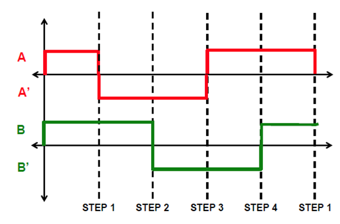
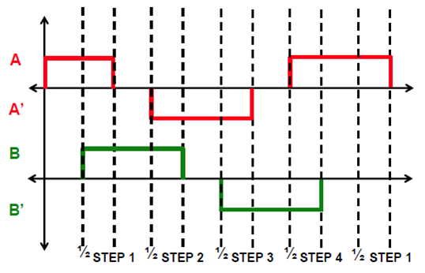
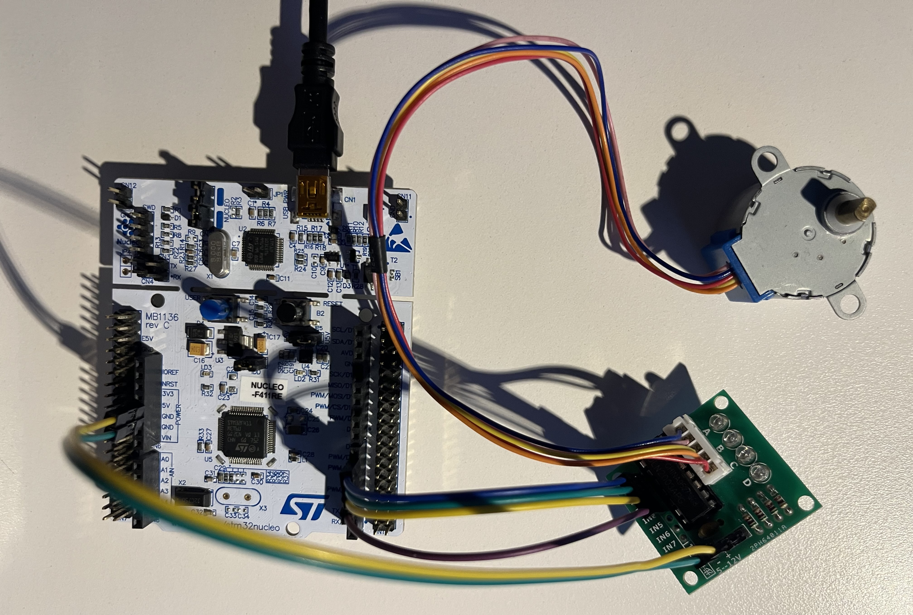

# LAB: Stepper Motor

**Date:** 2024-10-28

**Author:** Hee-Won Kim

**Github:** [KHW0619](https://github.com/KHW0619/Embedded-Controller/tree/master/LAB/LAB_Stepper_Motor)

**Demo Video:** [PROBLEM](https://youtu.be/yajiVYP-W3Y)

---

## **Introduction**

### **Requirement**

### **Hardware**

- MCU
    - NUCLEO-F411RE
- Actuator/Sensor/Others:
    - 3Stepper Motor 28BYJ-48
    - Motor Driver A4988 (tutorial)
    - Motor Driver ULN2003 (lab)
    - breadboard

### **Software**

- Keil uVision, CMSIS, EC_HAL library

---

## **Problem : Stepper Motor with 4-input sequence**

> In this lab, the **ULN2003 motor driver** will be used. Here, 4-input pulses have to be given in sequence.

---

### **Hardware Connection**


---

### **Stepper Motor Sequence**

> The unipolar stepper motor will be used for this lab.

**Full-stepping sequence**



| Phase | Port Pin | Sequence 1 | Sequence 2 | Sequence 3 | Sequence 4 |
|:-----:|:--------:|:----------:|:----------:|:----------:|:----------:|
|   A   |  PB_10   |     H      |     L      |     L      |     H      |
|   B   |   PB_4   |     H      |     H      |     L      |     L      |
|  A'   |   PB_5   |     L      |     H      |     H      |     L      |
|  B'   |   PB_3   |     L      |     L      |     H      |     H      |

**Half-stepping sequence**



| Phase | Port Pin | Sequence 1 | Sequence 2 | Sequence 3 | Sequence 4 | Sequence 5 | Sequence 6 | Sequence 7 | Sequence 8 |
|:-----:|:--------:|:----------:|:----------:|:----------:|:----------:|:----------:|:----------:|:----------:|:----------:|
|   A   |  PB_10   |     H      |     H      |     L      |     L      |     L      |     L      |     L      |     H      |
|   B   |   PB_4   |     L      |     H      |     H      |     H      |     L      |     L      |     L      |     L      |
|  A'   |   PB_5   |     L      |     L      |     L      |     H      |     H      |     H      |     L      |     L      |
|  B'   |   PB_3   |     L      |     L      |     L      |     L      |     L      |     H      |     H      |     H      |

### **Finite State Machine**

- Full-Stepping Sequence

|  State  |  Next State <br> DIR = 0  |  Next State <br> DIR = 1  |  Output <br> (A B A' B')  |
|:-------:|:-------------------------:|:-------------------------:|:-------------------------:|
|   S0    |            S1             |            S3             |           HHLL            |
|   S1    |            S2             |            S0             |           LHHL            |
|   S2    |            S3             |            S1             |           LLHH            |
|   S3    |            S0             |            S2             |           HLLH            |

- Half-Stepping Sequence

| State | Next State <br> DIR = 0 | Next State <br> DIR = 1  | Output <br> (A B A' B')  |
|:-----:|:-----------------------:|:------------------------:|:------------------------:|
|  S0   |           S1            |            S7            |           HLLL           |
|  S1   |           S2            |            S0            |           HHLL           |
|  S2   |           S3            |            S1            |           LHLL           |
|  S3   |           S4            |            S2            |           LHHL           |
|  S4   |           S5            |            S3            |           LLHL           |
|  S5   |           S6            |            S4            |           LLHH           |
|  S6   |           S7            |            S5            |           LLLH           |
|  S7   |           S0            |            S6            |           HLLH           |


```C++
// State number
typedef enum StateNum {
	S0. S1, S2, S3
} StateNum;

typedef struct State {
	uint8_t out;
	StateNum next[2];
} State_t;

State_t FSM[4] = {
	{0x9 , {S1, S3}},
	{0xA , {S2, S0}},
	{0x6 , {S3, S1}},
	{0x5 , {S0, S2}}
};
```

---

### **Create HAL library**

**ecStepper.h**

```C++
// Initialize with 4 pins
// ( A, B,  AN,  BN)
void Stepper_init(PinName_t A, PinName_t B,  PinName_t AN, PinName_t BN);

// whatSpeed [rev/min]
void Stepper_setSpeed(long whatSpeed);

// Run for n Steps
void Stepper_step(uint32_t steps, uint32_t direction, uint32_t mode);

// Immediate Stop.
void Stepper_stop(void);
```

---

### **Procedure**

> 1. The MCU is connected to the motor driver and the stepper motor.
> 2. The number of steps required to rotate 1 revolution using full-stepping is determined.
> 3. Then, the stepper motor is rotated 10 revolutions at 2 rpm, and it is measured to confirm if the motor completes one revolution per second.
> 4. The above process is repeated in the opposite direction.
> 5. The motor speed is increased and decreased as fast as possible to find the maximum and minimum speed of the motor.
> 6. Half-stepping is applied, and the above steps are repeated.

---

### **Configuration**

|                               Digital Out                               | SysTick  |
|:-----------------------------------------------------------------------:|:--------:|
| PB10, PB4, PB5, PB3 <br> NO Pull-up Pull-down <br> Push-Pull <br> Fast  | delay()  |

---

### **Discussion**

1. Find out the trapezoid-shape velocity profile for a stepper motor. When is this profile necessary?
    
    > The trapezoid-shaped velocity profile gradually changes the speed of the motor without applying load. This is used in motors where sudden changes in speed, such as abrupt stops, can cause excessive load and issues like heat generation.

2. How would you change the code more efficiently for micro-stepping control? You don’t have to code this but need to explain your strategy.
    
    > Just as the FULL step was divided in half to create the HALF step, the HALF step can be divided again to reduce the rotation size of each step, allowing for more precise control.

---

### **Code**

> The void setup(void) function configures the pins according to the specified configuration.
> 
> Stepper_step(2048, 1, HALF); rotates the stepper motor 2048 steps, in direction 1, using half-step mode.
> 
> The void EXTI15_10_IRQHandler(void) function operates when the BUTTON_PIN is pressed, stopping the motor's operation.

**My Code**

```C++
/*
******************************************************************************
* @author  Hee-Won Kim
* @Mod	   2024-10-22 by KHW0619
* @brief   Embedded Controller:  LAB_Stepper_Motor
******************************************************************************
*/

#include "stm32f411xe.h"
#include "ecSTM32F4v2.h"

void setup(void);

int main(void) {
    // Initialiization --------------------------------------------------------
    setup();

    Stepper_step(2048, 1, HALF);  // (Step : 2048, Direction : 0 or 1, Mode : FULL or HALF)

    // Inifinite Loop ----------------------------------------------------------
    while(1){;}
}

// Initialiization
void setup(void){

    RCC_PLL_init();                                     // System Clock = 84MHz
    SysTick_init();                                     // Systick init

    EXTI_init(BUTTON_PIN, FALL,0);  // External Interrupt Setting
    GPIO_init(BUTTON_PIN, INPUT);           // GPIOC pin13 initialization

    Stepper_init(PB_10,PB_4,PB_5,PB_3);                 // Stepper GPIO pin initialization
    Stepper_setSpeed(2);                          	    // set stepper motor speed
}

void EXTI15_10_IRQHandler(void) {
    if (is_pending_EXTI(BUTTON_PIN)) {
        Stepper_stop();
        clear_pending_EXTI(BUTTON_PIN);          // cleared by writing '1'
    }
}
```
---

### **Results**

The motor can be observed running in a consistent sequence until the specified number of steps is reached.

#### Circuit Diagram


#### Circuit


---

## **Reference**

> Zhu, Y. (2018). Embedded systems with ARM Cortex-M microcontrollers in assembly language and C (3rd ed.). E-Man Press LLC.

---