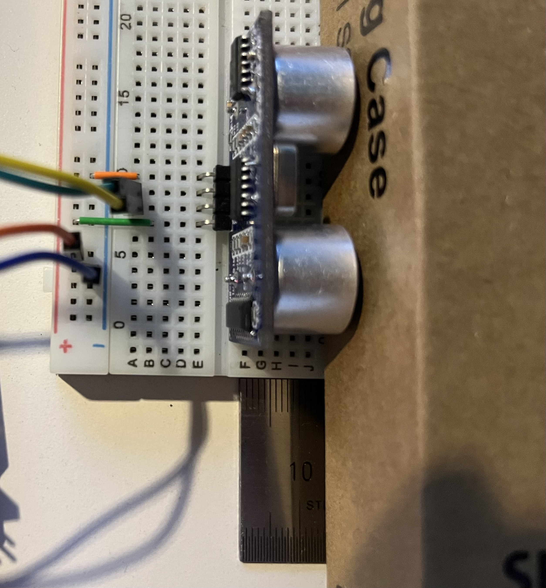

# LAB: Input Capture - Ultrasonic

**Date:** 2024-10-18

**Author:** Hee-Won Kim

**Github:** [https://github.com/KHW0619/Embedded-Controller/tree/master/LAB/LAB_TIMER_ICAP](https://github.com/KHW0619/Embedded-Controller/tree/master/LAB/LAB_TIMER_ICAP)

**Demo Video:** [PROBLEM2](https://youtube.com/shorts/EKoXdMHnV0w?feature=share)

## **Introduction**

> In this lab, a simple program measures distance using an ultrasonic distance sensor in input capture mode. The sensor also requires trigger pulses, which are generated using the timer output.

### **Requirement**

### **Hardware**

- MCU
    - NUCLEO-F411RE
- Actuator/Sensor/Others:
    - HC-SR04
    - breadboard

### **Software**

- Keil uVision, CMSIS, EC_HAL library

---

## **Tutorial: STM-Arduino**

> A simple program is created that measures distance using the ultrasonic sensor 'HC-SR04' and prints out the result through UART communication.

### **Procedure**

1. Create a new project under the directory `\EC\LAB\TIMER_ICAP`
2. Open *Arduino IDE* and Create a new program named as ‘**TU_arduino_TIMER_ICAP.ino**’.
3. Write the following code.
4. upload and run.

```C++
const int trigPin = 10;   // Trigger pin : PWM out
const int echoPin = 7;    // Echo pin : Interrupt in

unsigned long duration;
float distance;

void setup() {
  pinMode(trigPin, OUTPUT);
  pinMode(echoPin, INPUT);

  Serial.begin(9600);
}

void loop() {
  digitalWrite(trigPin, HIGH);
  delayMicroseconds(10);
  digitalWrite(trigPin, LOW);
  delayMicroseconds(10);

  duration = pulseIn(echoPin, HIGH);
  distance = (float)duration / 58.0;

  Serial.printf("duration : %d Distance : ", duration);
  Serial.print(distance);
  Serial.println(" [cm]");
  delay(500);
}
```

---

## **Problem 1: Create HAL library**

### **Create HAL library**

**ecCAP2.h**

```C++
/* Input Capture*/
// ICn selection according to CHn
#define FIRST 1
#define SECOND 2

// Edge Type
#define IC_RISE 0
#define IC_FALL 1
#define IC_BOTH 2

// IC Number
#define IC_1 1
#define IC_2 2
#define IC_3 3
#define IC_4 4

void ICAP_pinmap(PinName_t pinName, TIM_TypeDef **TIMx, int *chN);
void ICAP_init(PinName_t pinName);
void ICAP_setup(PinName_t pinName, int ICn, int edge_type);
void ICAP_counter_us(PinName_t pinName, int usec);
uint32_t ICAP_capture(TIM_TypeDef* TIMx, uint32_t ICn);

uint32_t is_CCIF(TIM_TypeDef *TIMx, uint32_t CCnum);  // CCnum= 1~4
void clear_CCIF(TIM_TypeDef *TIMx, uint32_t CCnum);
```

```C++
void ICAP_pinmap(PinName_t pinName, TIM_TypeDef **TIMx, int *chN);
```
The `ICAP_pinmap` function assigns the values of x and N for TIMx and chN according to the pinName.

```C++
void ICAP_init(PinName_t pinName);
```
The `ICAP_init` function configures the GPIO, TIMER, and Input Capture corresponding to the given pinName.

```C++
void ICAP_setup(PinName_t pinName, int ICn, int edge_type);
```
The `ICAP_setup` function configures the selection of TIMx-ICy and the edge type.

```C++
void ICAP_counter_us(PinName_t pinName, int usec);
```
The `ICAP_counter_us` function sets the time span for a single counter step.

```C++
uint32_t ICAP_capture(TIM_TypeDef* TIMx, uint32_t ICn);
```
The `ICAP_capture` function reads the CCR value corresponding to TIMx and ICn.

```C++
uint32_t is_CCIF(TIM_TypeDef *TIMx, uint32_t CCnum);  // CCnum= 1~4
```
The `is_CCIF` function checks the CCIF corresponding to ccNum in TIMx.

```C++
void clear_CCIF(TIM_TypeDef *TIMx, uint32_t CCnum);
```
The `clear_CCIF` function resets the CCIF corresponding to ccNum in TIMx.

---

## **Problem 2: Ultrasonic Distance Sensor (HC-SR04)**

> The HC-SR04 ultrasonic distance sensor. This economical sensor provides 2cm to 400cm of non-contact measurement functionality with a ranging accuracy that can reach up to 3mm. Each HC-SR04 module includes an ultrasonic transmitter, a receiver and a control circuit.

**The HC-SR04 Ultrasonic Range Sensor Features:**

- Input Voltage: 5V
- Current Draw: 20mA (Max)
- Digital Output: 5V
- Digital Output: 0V (Low)
- Sensing Angle: 30° Cone
- Angle of Effect: 15° Cone
- Ultrasonic Frequency: 40kHz
- Range: 2cm - 400cm

### **Procedure**

The HC-SR04 ultrasonic distance sensor connected to MCU pins(PA6 - trigger, PB6 - echo), VCC and GND.

### **Measurement of Distance**

The program needs to

- Generate a trigger pulse as PWM to the sensor.
- Receive echo pulses from the ultrasonic sensor
- Measure the distance by calculating pulse-width of the echo pulse.
- Display measured distance in [cm] on serial monitor of Tera-Term for
    
    (a) 10mm (b) 50mm (c) 100mm
    

### **Configuration**

| System Clock               | PWM                           | Input Capture |
|----------------------------|-------------------------------| --- |
| PLL (84MHz)                | PA6 (TIM3_CH1)                | PB6 (TIM4_CH1) |
|                            | AF, Push-Pull,                
 No Pull-up Pull-down, Fast | AF, No Pull-up Pull-down      |
|                            | PWM period: 50msec            
 pulse width: 10usec        | Counter Clock : 0.1MHz (10us) 
| | TI4 -> IC1 (rising edge)      | TI4 -> IC2 (falling edge)     |

### **Circuit Diagram**


### **Discussion**

1. There can be an over-capture case, when a new capture interrupt occurs before reading the CCR value. When does it occur and how can you calculate the time span accurately between two captures?

> To prevent a over-capture case, increase the interval at which the capture interrupt occurs.
> 
> To calculate the time span accurately between two captures, decrease the interval at which the capture interrupt occurs.
> 
> It is necessary to find the appropriate interval for the time interrupt to occur.
 
2. In the tutorial, what is the accuracy when measuring the period of 1Hz square wave? Show your result.

>The sensor operates at an ultrasonic frequency of 40kHz, but at a slower frequency of 1Hz, it is presumed to fail in detecting distances properly, resulting in a 0 output.

In the 50mm real distance

| Before                     | After the 1Hz square wave |
|----------------------------|---------------------------|
|  |    |

### **Code**

> In the setup function, pins are configured according to the required configuration, and in the TIM4_IRQHandler function, the overflow count, ARR value, and CCR values at the start and end times are used to obtain the time difference from the ultrasonic sensor, which is then converted into milliseconds.
> 
> In the while loop, the time information is converted into distance using the speed of sound, and the result is printed.

***My Code***

```C++
/*
******************************************************************************
* @author  Hee-Won Kim
* @Mod	   2024-10-18 by KHW0619
* @brief   Embedded Controller:  LAB_TIMER_ICAP
******************************************************************************
*/

#include "stm32f411xe.h"
#include "math.h"
#include "ecSTM32F4v2.h"

uint32_t ovf_cnt = 0;
float distance = 0;
float timeInterval = 0;
float time1 = 0;
float time2 = 0;

#define TRIG PA_6
#define ECHO PB_6

void setup(void);

int main(void){

	setup();

	while(1){
		distance = (float) timeInterval * 340.0 / 2.0 / 10.0; 	// [mm] -> [cm]
		printf("%f cm\r\n", distance);
		delay_ms(500);
	}
}

void TIM4_IRQHandler(void){
	if(is_UIF(TIM4)){                     // Update interrupt
		ovf_cnt++;													// overflow count
		clear_UIF(TIM4);  							    // clear update interrupt flag
	}
	if(is_CCIF(TIM4, 1)){ 								// TIM4_Ch1 (IC1) Capture Flag. Rising Edge Detect
		time1 = ICAP_capture(TIM4, 1);									// Capture TimeStart
		clear_CCIF(TIM4, 1);                // clear capture/compare interrupt flag
	}
	else if(is_CCIF(TIM4, 2)){ 									// TIM4_Ch2 (IC2) Capture Flag. Falling Edge Detect
		time2 = ICAP_capture(TIM4, 2);									// Capture TimeEnd
		timeInterval = (time2 - time1 + ovf_cnt * (TIM4->ARR + 1)) * 0.01; 	// (10us * counter pulse -> [msec] unit) Total time of echo pulse
		ovf_cnt = 0;                        // overflow reset
		clear_CCIF(TIM4,2);								  // clear capture/compare interrupt flag
	}
}

void setup(){

	RCC_PLL_init();
	SysTick_init();
	UART2_init();

// PWM configuration ---------------------------------------------------------------------
	PWM_init(TRIG);			// PA_6: Ultrasonic trig pulse
	PWM_period_us(TRIG, 50000);    // PWM of 50ms period. Use period_us()
	PWM_pulsewidth_us(TRIG, 10);   // PWM pulse width of 10us

// Input Capture configuration -----------------------------------------------------------------------
	ICAP_init(ECHO);    	// PB_6 as input caputre
 	ICAP_counter_us(ECHO, 10);   	// ICAP counter step time as 10us
	ICAP_setup(ECHO, 1, IC_RISE);  // TIM4_CH1 as IC1 , rising edge detect
	ICAP_setup(ECHO, 2, IC_FALL);  // TIM4_CH2 as IC2 , falling edge detect
}
```

### **Results**

> At 50mm and 100mm, the sensor produced values similar to the actual distance, but at 10mm, it failed to detect the value. This is because the actual sensor's specification has a range of 2cm to 400cm.

**Circuit Imge**


| Distance: 10mm                   | Distance: 50mm                   | Distance: 100mm                    |
|----------------------------------|----------------------------------|------------------------------------|
|  |  |  |
|             |             |             |

## **Reference**

> Zhu, Y. (2018). Embedded systems with ARM Cortex-M microcontrollers in assembly language and C (3rd ed.). E-Man Press LLC.

---
