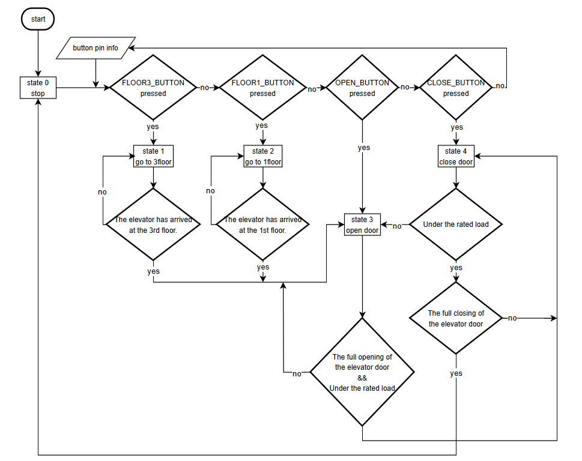

# Design Project

## LAB: EC Mobile Elevator

**Date:** 2024-12-16

**Author/Partner:** Jonghyeon Kim, Heewon Kim

**Github:** [https://github.com/KHW0619/Embedded-Controller/tree/master/LAB/final_project](https://github.com/KHW0619/Embedded-Controller/tree/master/LAB/final_project)

**Demo Video:** [https://youtu.be/kyRBU8IEpno](https://youtu.be/kyRBU8IEpno)

## I. Introduction

### Overview

We aim to get to the desired place by establishing an elevator system that can move vertically and horizontally. In particular, Newton 115 at Handong University and Oh-Seok Cu convenience store return frequently, so we aim to move between the two places.

### Requirements

#### Hardware

| Item           | Model/Description                      | Qty  |
| -------------- | -------------------------------------- | ---- |
| MCU            | NUCLEO -F411RE                         | 2    |
| Analog Sensor  | IR reflective optical sensor(TCRT5000) | 4    |
|                | Pressure sensor(FSR406)                | 1    |
| Digital Sensor | Ultrasonic sensor(HC-SR04)             | 1    |
|                | Buzzer(SM1205C)                        | 1    |
|                | TACT Switch (ITS-1105RT)               | 6    |
| Actuator       | DC motor(CHF-GM12-N20)                 | 3    |
|                | RC Servo motor(SG90)                   | 1    |
| Display        | 7-Segment display(5101ASR)             | 1    |
| Communication  | Bluetooth module(HC-05)                | 2    |

#### Software

Keil uVision IDE, CMSIS, EC_HAL

------

## II. Problem

### Problem Description

**1.** **System State:**

| State                                                | Description                                                  |
| ---------------------------------------------------- | ------------------------------------------------------------ |
| S0(Elevator Stop State)                              | The door is closed and stationary. It's also in its initial state. |
| S1(Elevator Movement to the 3rd Floor(Oseok Hall))   | This refers to the state in which the elevator is moving to the 3rd floor(Oseok Hall). This is the state when the call button or the 3rd floor (Oseok Hall) button is pressed. |
| S2((Elevator Movement to the 1st Floor(Newton Hall)) | This refers to the state in which the elevator is moving to the 1st floor(Newton Hall). This is the state when the call button or the 1st floor (Newton Hall) button is pressed |
| S3(Elevator Door Open)                               | The state of all the processes in which the door is being opened. In other words, it refers to the state in which the door is opened by arriving at a certain floor or through the door opening button. |
| S4((Elevator Door Closed)                            | It is a state that refers to a series of processes in which a door is closed. That is, it refers to a state in which it automatically closes over time in an open state or closes by pressing a door-closing button. |


**2. Sensor Unit: MCU_1**

| Function                             | Sensor                   | Configuration                                                | Comments                                                     |
| ------------------------------------ | ------------------------ | ------------------------------------------------------------ | ------------------------------------------------------------ |
| Elevator floor detect(Up/Down)       | IR sensor(Digital)       | Output                                                       | When the elevator moves up and down and recognizes the elevator shaft, it informs the information. |
| Open/Close Door                      | Servo Motor              | AF, Push-Pull, No Pull-up Pull-down, Fast Speed<br />TIM1(PWM) period: 10msec(100Hz) |                                                              |
| Elevator shaft moving                | DC motor                 | Output, Open Drain                                           | The Elevator shaft stops if the Elevator floor detector(Up/Down) is operated |
| Elevator floor display               | 7-segment display        | Output, Push-Pull, No Pull-up Pull-down, Medium Speed        | It shows where a person is on and which floor the elevator is moving on.                                                             |
| Overweight Detect                    | Pressure Sensor / Buzzer | ADC Clock Prescaler/8 12-bit resolution, right alignment Continuous Conversion mode Scan mode: Two channels in regular group External Trigger (Timer5 Trigger) @ 1kHz Trigger Detection on Rising Edge<br />/Output | The pin has to be fixed well. If Overweight is detected, Buzzer Alert. |
| Line Tracing                         | IR sensor                | ADC Clock Prescaler/8 12-bit resolution, right alignment Continuous Conversion mode Scan mode: Two channels in regular group External Trigger (Timer5 Trigger) @ 1kHz Trigger Detection on Rising Edge | Since the elevator moves horizontally, it functions to inform that it has arrived at a building.<br />Right IR sensor detect black ->Right tire slow.<br />Left IR sensor detects black ->Left tire slow. |
| Obstacle detect                      | Ultrasonic sensor        | AF, No Pull-up Pull-down, High Speed<br />Counter Clock : 1MHz (1us) TI4 -> IC1 (rising edge) TI4 -> IC2 (falling edge) | If you move and you are in front of an obstacle or person, it detects and stops.                                                             |
| Mobile Elevator moving(Horizontally) | DC motor                 | AF, Push-Pull, No Pull-up Pull-down, Fast Speed<br />TIM1(PWM) period: 1msec(1kHz) | It is divided into a motor that moves the entire car horizontally and a motor that moves the elevator. Each speed is designated differently. |
| Input Signal                         | TACT Switch              | Input, Push-Pull                                             | It is the source of all operations. It receives information from the button to start the operation. |


**3. Sensor Unit: MCU_2**

| Function      | Sensor           | Configuration                                                | Comments                                                     |
| ------------- | ---------------- | ------------------------------------------------------------ | ------------------------------------------------------------ |
| Input Signal  | TACT Switch      | Input, Push-Pull                                             | It is the source of all operations. It receives information from the button to start the operation. |
| Communication | Bluetooth module | AF, Push-Pull, No Pull-up Pull-down, High Speed<br />No Parity, 8-bit Data,1-bit Stop bit 9600 baud-rate | When the call button signal comes on, it serves to send the signal. Start communication between Bluetooth. |


### MCU Configuration

#### MCU1

| Functions             | Register       | PORT_PIN                                                     | Configuration                                                |
| --------------------- | -------------- | ------------------------------------------------------------ | ------------------------------------------------------------ |
| System Clock          | RCC            | -                                                            | PLL 84MHz                                                    |
| delay_ms              | SysTick        | -                                                            |                                                              |
| 7-segnemt display     | Digital Out    | PD_2<br />PC_11<br />PC_12<br />PC_10<br />PA_13<br />PA_14<br />PA_15<br />PB_7 | Output, Push-Pull, No Pull-up Pull-down, Medium Speed        |
| Motor DIR(Elevator)   | Digital Out    | PC_2                                                         | Output, Open Drain                                           |
| Motor DIR(RC Car)     | Digital Out    | PA_11<br />PA_12                                             | Output, Open-Drain                                           |
| Elevator IR(Detector) | Digital Input  | PB_1<br />PC_8                                               | Input                                                        |
| Alert                 | Digital Output | PB_8                                                         | Output                                                       |
| External Interrupt    | EXTI           | PB_12<br />PB_15<br />PB_14<br />PB_13                       | Input, Falling Edge, Pull-Up                                 |
| PWM(RC Car)           | TIMER2         | PA_0: TIM2_CH1<br />PA_1: TIM2_CH2                           | AF, Push-Pull, No Pull-up Pull-down, Fast Speed<br />TIM1(PWM) period: 1msec(1kHz) |
| PWM(Elevator shaft)   | TIMER2         | PB_10: TIM2_CH3                                              | AF, Push-Pull, No Pull-up Pull-down, Fast Speed<br />TIM1(PWM) period: 1msec(1kHz) |
| PWM(Servo Motor)      | TIMER3         | PC_9: TIM3_CH4                                               | AF, Push-Pull, No Pull-up Pull-down, Fast Speed<br />TIM1(PWM) period: 10msec(100Hz) |
| Input Capture         | TIMER4         | PB_6: TIM4_CH1                                               | AF, No Pull-up Pull-down, High Speed<br />Counter Clock : 1MHz (1us) TI4 -> IC1 (rising edge) TI4 -> IC2 (falling edge) |
| PWM(ULTRASONIC)       | TIMER3         | PA_6: TIM3_CH1                                               | AF, Push-Pull, No Pull-up Pull-down, Fast Speed<br />TIM3(PWM) period: 50msec pulse width: 10usec |
| Bluetooth             | USART1         | TX: PA_9 RX: PA_10                                           | AF, Push-Pull, No Pull-up Pull-down, High Speed<br />No Parity, 8-bit Data,1-bit Stop bit 9600 baud-rate |
| Timer Interrupt       | TIMER2         | -                                                            | TIM2: Timer Interrupt of 1 msec                              |
|                       | TIMER9         | -                                                            | TIM9: Timer Interrupt of 30 msec                             |
| ADC(JADC)             | ADC            | PC_0: ADC1_CH10 (1st channel)<br />PC_1: ADC1_CH11 (2nd channel)<br />PC_5: ADC1_CH15 (3rd channel) | ADC Clock Prescaler/8 12-bit resolution, right alignment Continuous Conversion mode Scan mode: Two channels in regular group External Trigger (Timer5 Trigger) @ 1kHz Trigger Detection on Rising Edge |

#### MCU2

| Functions    | Register      | PORT_PIN           | Configuration                                                |
| ------------ | ------------- | ------------------ | ------------------------------------------------------------ |
| System Clock | RCC           | -                  | PLL 84MHz                                                    |
| Call Button  | Digital Input | PA_8<br />PC_7     | Input, Push-Pull                                             |
| Bluetooth    | USART1        | TX: PA_9 RX: PA_10 | AF, Push-Pull, No Pull-up Pull-down, High Speed<br />No Parity, 8-bit Data,1-bit Stop bit 9600 baud-rate |

### Circuit Diagram


### Functional Prototype

- Front


- Back


- Side1


- Side2


## III. Algorithm

### Logic Design

The flowchart was created based on the essential inputs to make it easy to understand.



### Code Explanation

MCU 1

Function

> 0. setup(void)
>
> This function initializes the hardware components of the system and performs the initial setup of clocks, UART, ADC, timers, GPIO pins, PWM, and input capture.

> 1. state0(void) (Elevator Stop State)
>
> Operation:
>
> The (CloseDoor) variable is set to 1 to keep the elevator doors closed, and the (updown_flag) variable is set to 0 to stop the elevator's upward and downward movement.
>
> State Change Conditions:
> - If the (MoveFloor[0]) variable has higher priority through a button press, the state is changed to 1 to move the elevator to the 3rd floor.
> - If the (MoveFloor[1]) variable has higher priority through a button press, the state is changed to 2 to move the elevator to the 1st floor.

> 2. state1(void) (Elevator Movement to the 3rd Floor)
>
> Operation
>
> The (CloseDoor) variable is set to 1 to keep the elevator doors closed, the (ELEV_dir_value) variable is set to HIGH, and when the (DoorState) variable is 1, confirming that the doors are fully closed, the (updown_flag) is set to 1 to initiate the movement.
>
> State Change Conditions
>
> - Once the elevator reaches the 3rd floor (FloorState == 3) and the (car_moving) variable is set to 0, confirming that the elevator's movement has stopped, the state is changed to 3 to open the doors.

> 3. state2(void) (Elevator Movement to the 1st Floor)
>
> Operation:
>
> The (CloseDoor) variable is set to 1 to keep the elevator doors closed, the (ELEV_dir_value) variable is set to LOW, and when the (DoorState) variable is 1, confirming that the doors are fully closed, the (updown_flag) is set to 1 to initiate the movement.
>
> State Change Conditions:
>
> - Once the elevator reaches the 1st floor (FloorState == 1) and the (car_moving) variable is set to 0, confirming that the elevator's movement has stopped, the state is changed to 3 to open the doors.

> 4. state3(void) (Elevator Door Open)
>
> Operation:
>
> The (CloseDoor) variable is set to 0 to open the elevator doors. The (OverWeight) variable is checked, and if its value is HIGH, the buzzer is activated. The (updown_flag) is set to 0 to maintain the stop state.
>
> State Change Conditions:
>
> - If the (OverWeight) variable is not HIGH, the state changes to state 4 (Door Closing) to close the doors.

> 5. state4(void) (Elevator Door Closed)
>
> Operation:
>
> The (CloseDoor) variable is set to 1 to close the elevator doors, and the (updown_flag) is set to 0 to maintain the stop state.
>
> State Change Conditions:
>
> - If the (OverWeight) variable is HIGH, the state changes to state 3 (Door Open) to open the doors again.
> - Once the doors are fully closed and the (DoorState) variable becomes 1, the state changes to 0 to maintain the elevator in the stop state.

> 6. change_state(void) (State operations)
>
> This function performs state operations at a 1ms interval in the TIM2_IRQHandler(void). Each state performs the following actions: stopping the elevator's movement, moving to the 3rd floor, moving to the 1st floor, opening the elevator doors, and closing the elevator doors.

> 7. car_move(void)
>
> This function operates the wheels of the mobile elevator at a 1ms interval in TIM2_IRQHandler(void).

> 8. sevensegment_decoder_set(uint8_t  num)
>
> This function displays the floor number on the seven-segment display when the elevator is at the 1st or 3rd floor, at a 1ms interval in TIM2_IRQHandler(void).

Handler

> 0. TIM2_IRQHandler(void)
>
> The TIM2_IRQHandler(void) function performs actions based on the changed values according to the state.
>
> - The elevator's operating status is displayed on the 7-segment display. When moving up, it shows "U", when moving down, it shows "d", at the 1st floor, it shows "1", and at the 3rd floor, it shows "3".
>
> - In the ADC_IRQHandler(void), the (PRESSURE_VALUE) is read, and if it exceeds a set threshold, the buzzer is triggered, and (OverWeight) is set to 1. If it is below the threshold, the buzzer is turned off and (OverWeight) is set to 0.
>
> - The change_state(void) and car_move(void) functions are used to control the operation of the movable elevator.
>
> - The current floor of the elevator is determined by checking the (ELEV_dir_value) and (UPPER_IR_value). The (updown_flag) variable is set to 0 to stop the vertical movement, and based on the position, the (FloorState) is set to either 1st or 3rd floor.
>
> - The vertical movement of the elevator is controlled based on the value of (updown_flag).

> 1. TIM4_IRQHandler(void) (Timer Interrupt for INPUT CAPTURE ULTRA SONIC)
>
> In TIM4_IRQHandler(void), the distance information is received from the ultrasonic sensor via input capture. If the distance is below the threshold, the (obstacle) variable is set to LOW, stopping the wheels of the movable elevator. If the distance is above the threshold, the (obstacle) variable is set to HIGH, allowing the wheels to operate normally.

> 2. TIM1_BRK_TIM9_IRQHandler(void) (Servo Motor Operating for Door open ELE)
>
> TIM1_BRK_TIM9_IRQHandler(void) performs the door opening and closing operations of the elevator. The (DoorState) variable is set to 0 when the door is fully open, 1 when it is fully closed, and 2 for all other situations.

> 3. EXTI15_10_IRQHandler(void) (read inner button pins)
>
> In the EXTI15_10_IRQHandler(void) function, the inputs from the button pins are checked.
>
> - When either the OPEN_BUTTON or CLOSE_BUTTON is pressed, and the elevator is not moving, the (CloseDoor) variable is set to 0 or 1 to issue open or close door commands, respectively. At the same time, the state is updated to the door open state 3 or the door close state 4.
>
> - When the FLOOR1_BUTTON or FLOOR3_BUTTON is pressed, and the elevator is not moving, the variables (MoveFloor[0]) for moving to the 1st floor and (MoveFloor[1]) for moving to the 3rd floor are set according to priority.

> 4. USART1_IRQHandler(void) (read outer button pins)
>
> USART1_IRQHandler(void) reads the input from external button presses. If the received data is 1, it corresponds to the call button pressed from the 3rd floor. If the data is 2, it corresponds to the call button pressed from the 1st floor. These two buttons function the same as the FLOOR1_BUTTON and FLOOR3_BUTTON handled in EXTI15_10_IRQHandler(void).

> 5. ADC_IRQHandler(void)
>
> - Two IR sensors attached for the movement of the mobile elevator's wheels are read as analog values. Based on the values, the elevator performs right turns, left turns, or moves straight.
>
> - The pressure sensor's analog value is read and stored in PRESSURE_VALUE.

MCU 2

> The signals from UP_BUTTON_PIN and DOWN_BUTTON_PIN are received. If UP_BUTTON_PIN is pressed, the value 1 is sent via Bluetooth communication. If DOWN_BUTTON_PIN is pressed, the value 2 is sent. If neither button is pressed, the value 0 is sent.

### Code

MCU 1

```C++
/**
******************************************************************************
* @author  Jong-Hyeon Kim / Hee-Won Kim
* @Mod	   2024-12-16
* @brief   PROJECT_Mobile_Elevator
******************************************************************************
*/

#include "stm32f411xe.h"
#include "ecSTM32F4v2.h"

//RC CAR
//TIRE (DC MOTOR)
#define RC_LEFT_DIR 	PA_11
#define RC_LEFT_PWM 	PA_0  // TIM2 CH1
#define RC_RIGHT_DIR 	PA_12
#define RC_RIGHT_PWM 	PA_1  // TIM2 CH2
#define RC_IR_LEFT 		PC_1
#define RC_IR_RIGHT 	PC_0

//ULTRASONIC
#define ULTRASONIC_TRIG PA_6  // TIM3 CH1
#define ULTRASONIC_ECHO PB_6

//ELEVATOR DOOR
#define DOOR_MOTOR 		PC_9

#define CLOSE_BUTTON 	PB_12
#define OPEN_BUTTON		PB_15
#define FLOOR3_BUTTON 	PB_14
#define FLOOR1_BUTTON 	PB_13

// ELEVATOR MOVING
#define ELEV_PWM_PIN 	PB_10
#define ELEV_DIR_PIN 	PC_2
#define UPPER_IR_PIN    PB_1
#define LOWER_IR_PIN    PC_8

#define ALERT			PB_8

// Elevator Up-Down Moving Variable
static int updown_flag		= LOW;
static int UPPER_IR_value	= HIGH;
static int LOWER_IR_value	= HIGH;
static int ELEV_dir_value	= 0;
static float ELEV_duty_value	= 0.0;

uint32_t OPEN = 0;

// ULTRA SONIC
uint32_t ovf_cnt = 0;
float time1 = 0;
float time2 = 0;
float distance = 0;
float prevDist = 1000;
float timeInterval = 0;

char obstacle = HIGH;
char car_moving = 0;

// BLUETOOTH
static volatile uint8_t PC_Data = 0;
static volatile uint8_t BT_Data = 0;
char BT_string[200];

// DC MOTOR
float Leftinterval	= 0;
float Rightinterval = 0;

//IR parameter//
uint32_t RC_IR_RIGHT_VALUE, RC_IR_LEFT_VALUE;
PinName_t seqCHn[3] = {PC_0, PC_1, PC_5};
PinName_t SEVEN_SEGMENT_DECODER_PIN_ELE[8] = {PD_2, PC_11, PC_12, PC_10, PA_13, PA_14, PA_15, PB_7};
uint8_t seven_segment_decoder_state_ele[8] = {LOW};

uint32_t PRESSURE_VALUE;
uint8_t OverWeight = 0;

// ELEVATOR FSM
uint32_t CloseDoor		= HIGH;
uint32_t DoorState		= LOW;
uint32_t FloorState		= 1;
uint32_t MoveFloor[2]	= {0};

uint32_t state			= LOW;
uint32_t PlaceDetected	= LOW;

static int count_pressure = 0;

void change_state(void);
void state0(void);
void state1(void);
void state2(void);
void state3(void);
void state4(void);
void car_move(void);
void sevensegment_decoder_set(uint8_t  num);
void setup(void);

int main(void) {
	// Initialization --------------------------------------------------
	setup();

	// Infinite Loop ---------------------------------------------------
	while(1){};
}

void TIM2_IRQHandler(void){
	if(is_UIF(TIM2)){

		// 7 segment
		if(FloorState && !car_moving) {
			sevensegment_decoder_set(FloorState);
		}
		else {
			seven_segment_decoder_state_ele[0] = HIGH;
			seven_segment_decoder_state_ele[1] = LOW;
			seven_segment_decoder_state_ele[2] = LOW;
			seven_segment_decoder_state_ele[3] = LOW;
			seven_segment_decoder_state_ele[4] = LOW;
			seven_segment_decoder_state_ele[5] = LOW;
			seven_segment_decoder_state_ele[6] = LOW;
			seven_segment_decoder_state_ele[7] = LOW;

			if(ELEV_dir_value == LOW) { // DOWN
				seven_segment_decoder_state_ele[5] = HIGH;
			}
			if(ELEV_dir_value == HIGH) { // UP
				seven_segment_decoder_state_ele[6] = HIGH;
			}

			for(int i = 0; i < 8; i++) {
				GPIO_write(SEVEN_SEGMENT_DECODER_PIN_ELE[i], seven_segment_decoder_state_ele[i]);
			}
		}

		// If weight is over. Caution!!!
		if(PRESSURE_VALUE > 700) {
			GPIO_write(ALERT,1);
			OverWeight = 1;
		}
		else {
			GPIO_write(ALERT,0);
			OverWeight = 0;
		}

		// ELEVATOR FSM CONTROL TOWER
		change_state();

		car_move();

		// if UPPER_IR is detected input data is '0'
		UPPER_IR_value = GPIO_read(UPPER_IR_PIN);
		LOWER_IR_value = !GPIO_read(LOWER_IR_PIN);

		FloorState = 0;

		if(UPPER_IR_value == LOW && ELEV_dir_value == HIGH) {
			updown_flag = 0;
			FloorState = 3;
		}

		if(LOWER_IR_value == LOW && ELEV_dir_value == LOW) {
			updown_flag = 0;
			FloorState = 1;
		}

		if (updown_flag == 0) {
			GPIO_write(ELEV_DIR_PIN, ELEV_dir_value);
			PWM_duty(ELEV_PWM_PIN,  ELEV_dir_value);
		}
		else PWM_duty(ELEV_PWM_PIN,  ELEV_duty_value);

		clear_UIF(TIM2); 		// Clear UI flag by writing 0
	}
}

// 차량 정지 여부
//Timer Interrupt for INPUT CAPTURE ULTRA SONIC
void TIM4_IRQHandler(void) {
	if(is_UIF(TIM4)){													// Update interrupt
		ovf_cnt++;														// overflow count
		clear_UIF(TIM4);  												// clear update interrupt flag
	}

	if(is_CCIF(TIM4, 1)){ 										// TIM4_Ch1 (IC1) Capture Flag. Rising Edge Detect
		time1 = ICAP_capture(TIM4,1);								// Capture TimeStart
		clear_CCIF(TIM4, 1);										// clear capture/compare interrupt flag
	}
	else if(is_CCIF(TIM4,2)){ 									// TIM4_Ch1 (IC2) Capture Flag. Falling Edge Detect
		time2 = ICAP_capture(TIM4,2);								// Capture TimeEnd
		timeInterval = ((time2-time1)+ovf_cnt*(TIM4->ARR+1.0))*0.01; 	// (10us * counter pulse -> [msec] unit) Total time of echo pulse
		ovf_cnt = 0;													// overflow reset
		clear_CCIF(TIM4,2);										// clear capture/compare interrupt flag
	}
	distance = (float)timeInterval * 340.0 / 2.0 / 10.0;

	if(distance < 30.0) obstacle = LOW;
	else obstacle = HIGH;
}

// 문 닫힘 DoorClosed = HIGH
// 문 열림 DoorClosed = LOW
// Servo Motor Operating for Door open ELE
void TIM1_BRK_TIM9_IRQHandler(void){
	static uint32_t count = 0;

	if(is_UIF(TIM9)) {
		PWM_duty(DOOR_MOTOR, (float)((0.5+(1.0/60.0)*count)/10.0));

		if (CloseDoor && count > 0) count--;
		else if (!CloseDoor && count < 50) count++;

		if(count <= 0) {
			DoorState = 1;
		}
		else if(count >= 50) {
			DoorState = 0;
		}
 		else {
 			DoorState = 2;
 		}

		clear_UIF(TIM9); 		// Clear UI flag by writing 0
	}
}

// 내부 버튼
void EXTI15_10_IRQHandler(void) {
	if(is_pending_EXTI(OPEN_BUTTON)) {
		if(state != 1 && state != 2 && !car_moving) {
			CloseDoor = 0;

			state = 3;
		}

		clear_pending_EXTI(OPEN_BUTTON);
	}
	else if(is_pending_EXTI(CLOSE_BUTTON)) {
		if(state != 1 && state != 2 && !car_moving) {
			CloseDoor = 1;

			state = 4;
		}

		clear_pending_EXTI(CLOSE_BUTTON);
	}
	else if(is_pending_EXTI(FLOOR1_BUTTON)) {
		if(FloorState != 1 && !car_moving) {
			MoveFloor[0] = 1;

			// 우선순위 지정
			if(MoveFloor[1]) MoveFloor[0]++;
		}

		clear_pending_EXTI(FLOOR1_BUTTON);
	}
	else if(is_pending_EXTI(FLOOR3_BUTTON)) {
		if(FloorState != 3 && !car_moving) {
			MoveFloor[1] = 1;

			// 우선순위 지정
			if(MoveFloor[0]) MoveFloor[1]++;
		}

		clear_pending_EXTI(FLOOR3_BUTTON);
	}
}

// 외부 버튼
void USART1_IRQHandler(){
	if(is_USART1_RXNE()){
		BT_Data = USART1_read();

		if(BT_Data == 1) { // 1 -> 3

			if(FloorState != 1 && state != 1 && state != 2) {
				MoveFloor[0] = 1;

				// 우선순위 지정
				if(MoveFloor[1]) MoveFloor[0]++;
			}
			else if(FloorState == 1 && state != 1 && state != 2) {
				state = 3;
			}
		}
		else if(BT_Data == 2) { // 3 -> 1

			if(FloorState != 3 && state != 1 && state != 2) {
				MoveFloor[1] = 1;

				// 우선순위 지정
				if(MoveFloor[0]) MoveFloor[1]++;
			}
			else if(FloorState == 3 && state != 1 && state != 2) {
				state = 3;
			}
		}
	}
}

// 차량 조향
// RC CAR IR VALUE
void ADC_IRQHandler(void){
	if(is_ADC_OVR())
		clear_ADC_OVR();

	if(is_ADC_JEOC()){		// after finishing sequence
		RC_IR_RIGHT_VALUE	= JADC_read(1);
		RC_IR_LEFT_VALUE	= JADC_read(2);
		PRESSURE_VALUE		= JADC_read(3);

		if(RC_IR_RIGHT_VALUE > 1500 && RC_IR_LEFT_VALUE > 1500) { // stop
			Leftinterval	= 1;
			Rightinterval	= 1;
			if(FloorState)
				car_moving = 0;
			else car_moving = 1;
		}
		else if(RC_IR_RIGHT_VALUE > 1500 && RC_IR_LEFT_VALUE < 1500) {// turn right
			Leftinterval	= 0;
			Rightinterval	= 1;
			car_moving		= 1;
		}
		else if(RC_IR_RIGHT_VALUE < 1500 && RC_IR_LEFT_VALUE > 1500) { // turn left
			Leftinterval	= 1;
			Rightinterval	= 0;
			car_moving		= 1;
		}
		else { // go straight
			Leftinterval	= 1;
			Rightinterval	= 1;
			car_moving		= 1;
		}

		clear_ADC_JEOC();
	}
}

// state set
void change_state(void) {

	switch(state) {
		case 0: // stop state
			state0();

		break;
		case 1: // move to 3 floor
			state1();

		break;
		case 2: // move to 1 floor
			state2();

		break;
		case 3: // open door
			state3();

		break;
		case 4: // close door
			state4();

		break;
		default:
			break;
	}
}

// stop elevator
void state0(void) {
	CloseDoor = 1; //닫힘
	updown_flag = 0;

	state = 0;
	if(MoveFloor[0] == 1 && MoveFloor[1] == 2) {
		MoveFloor[0] = 0;
		MoveFloor[1] = 1;
		state = 2;
	}
	else if(MoveFloor[0] == 1 && MoveFloor[1] == 0) {
		MoveFloor[0] = 0;
		MoveFloor[1] = 0;
		state = 2;
	}
	else if(MoveFloor[1] == 1 && MoveFloor[0] == 2) {
		MoveFloor[0] = 1;
		MoveFloor[1] = 0;
		state = 1;
	}
	else if(MoveFloor[1] == 1 && MoveFloor[0] == 0) {
		MoveFloor[0] = 0;
		MoveFloor[1] = 0;
		state = 1;
	}
}

// move elevator to the 3 floor
void state1(void) {
	CloseDoor = 1;
	ELEV_dir_value = HIGH;
	ELEV_duty_value = 0.5;
	updown_flag = 0;

	GPIO_write(ELEV_DIR_PIN, ELEV_dir_value);
	if(DoorState == 1) updown_flag = 1;
	if(FloorState == 3 && !car_moving) state = 3;
}

// move elevator to the 1 floor
void state2(void) {
	CloseDoor = 1;
	ELEV_dir_value = LOW;
	ELEV_duty_value = 0.5;
	updown_flag = 0;

	GPIO_write(ELEV_DIR_PIN, ELEV_dir_value);
	if(DoorState == 1) updown_flag = 1;
	if(FloorState == 1 && !car_moving) state = 3;
}

// open elevator door
void state3(void) {
	CloseDoor = 0;
	updown_flag = 0;

	if(OverWeight) GPIO_write(ALERT, HIGH);
	else GPIO_write(ALERT, LOW);

	count_pressure ++;

	if(!OverWeight && DoorState == 0 && count_pressure > 5000) {
		state = 4;
	}

	if(count_pressure > 5000) count_pressure = 0;
}

// close elevator door
void state4(void) {
	updown_flag = 0;
	CloseDoor = 1;

	if(OverWeight) {
		state = 3;
	}

	if(DoorState == 1) {
		delay_ms(2000);
		state = 0;
	}
}

// 차량 정지 car_moving = LOW
// 차량 동작 car_moving = HIGH
void car_move(void) {
	PWM_duty(RC_LEFT_PWM, 1 - ( 0.7 * Rightinterval) * obstacle * car_moving);
	PWM_duty(RC_RIGHT_PWM, 1 - ( 0.7 * Leftinterval) * obstacle * car_moving);
}

void sevensegment_decoder_set(uint8_t  num) {
	int seven_segment_state[4] = {0};
	int A = 0, B = 0, C = 0, D = 0;

	for(int i = 0; i < 4; i++) {
		seven_segment_state[i] = (num >> i) & ( 1 );
	}

	A = seven_segment_state[0];
	B = seven_segment_state[1];
	C = seven_segment_state[2];
	D = seven_segment_state[3];

	seven_segment_decoder_state_ele[0] = (~D & ~C & ~B & A) | (~D & C & ~A);
	seven_segment_decoder_state_ele[1] = (C & ~B & A) + (~D & C & B & ~A);
	seven_segment_decoder_state_ele[2] = ~D & ~C & B & ~A;
	seven_segment_decoder_state_ele[3] = (~C & ~B & A) | (~D & C & ~B & ~A) | (C & B & A) | (D & C & B);
	seven_segment_decoder_state_ele[4] = A | (C & ~B) | (D & B);
	seven_segment_decoder_state_ele[5] = (~D & ~C & A) | (~D & ~C & B) | (B & A) | (D & C);
	seven_segment_decoder_state_ele[6] = (~D & ~C & ~B) | (C & B & A) | (D & C & B);


	for(int i = 0; i < 8; i++) {
		GPIO_write(SEVEN_SEGMENT_DECODER_PIN_ELE[i], seven_segment_decoder_state_ele[i]);
	}
}

// Setting setup
void setup(void) {
	RCC_PLL_init();				// System Clock Initiallization
    SysTick_init();

	UART1_init();
	UART1_baud(BAUD_9600);

	// ADC Init  Default: HW triggered by TIM3 counter @ 1msec
	JADC_init(PC_0);
	JADC_init(PC_1);
	JADC_init(PC_5);

	// ADC channel sequence setting
	JADC_sequence(seqCHn, 3);

	GPIO_init(ALERT,OUTPUT);

	// Timer Update Interrupt
	// TIM3: set Update interrupt by Timer 3
	// 500: timeperiod = 500m second
	TIM_UI_init(TIM2, 1);
    TIM_UI_init(TIM9, 30);

	EXTI_init(OPEN_BUTTON, FALL,1);
	EXTI_init(CLOSE_BUTTON, FALL,1);
	EXTI_init(FLOOR1_BUTTON, FALL,1);
	EXTI_init(FLOOR3_BUTTON, FALL,1);
	GPIO_init(OPEN_BUTTON, INPUT);
	GPIO_init(CLOSE_BUTTON, INPUT);
	GPIO_init(FLOOR1_BUTTON, INPUT);
	GPIO_init(FLOOR3_BUTTON, INPUT);
	GPIO_pupd(OPEN_BUTTON, PULL_UP);
	GPIO_pupd(CLOSE_BUTTON,  PULL_UP);
	GPIO_pupd(FLOOR1_BUTTON, PULL_UP);
	GPIO_pupd(FLOOR3_BUTTON, PULL_UP);

	GPIO_init(UPPER_IR_PIN, INPUT);
	GPIO_init(LOWER_IR_PIN, INPUT);

	GPIO_init(RC_LEFT_DIR, OUTPUT);
	GPIO_init(RC_RIGHT_DIR, OUTPUT);
	GPIO_otype(RC_LEFT_DIR, OPEN_DRAIN);
	GPIO_otype(RC_RIGHT_DIR,OPEN_DRAIN);
	GPIO_write(RC_LEFT_DIR, 1);
	GPIO_write(RC_RIGHT_DIR, 1);


	// RC_RIGHT_PWM of 1 msec: TIM2_CH1 (PA_1 AFmode)
	// RC_LEFT_PWM of 1 msec:  TIM2_CH2 (PA_0 AFmode)
	PWM_init(RC_LEFT_PWM);
	PWM_init(RC_RIGHT_PWM);
	PWM_period(RC_LEFT_PWM, LOW);
	PWM_period(RC_RIGHT_PWM, LOW);

	/* INPUT CAPTURE FOR ULTRA SONIC */
	// PWM Trigger configuration ---------------------------------------------------------------------
	PWM_init(ULTRASONIC_TRIG);								// PA_6: Ultrasonic trig pulse
	PWM_period_us(ULTRASONIC_TRIG, 1000);				// PWM of 50ms period. Use period_us()
	PWM_pulsewidth_us(ULTRASONIC_TRIG, 10);		// PWM pulse width of 10us

	// Input Capture configuration -----------------------------------------------------------------------
	ICAP_init(ULTRASONIC_ECHO);    							// PB_6 as input caputre
	ICAP_counter_us(ULTRASONIC_ECHO, 10);   				// ICAP counter step time as 10us
	ICAP_setup(ULTRASONIC_ECHO, 1, IC_RISE);		// TIM4_CH1 as IC1 , rising edge detect
	ICAP_setup(ULTRASONIC_ECHO, 2, IC_FALL);		// TIM4_CH2 as IC2 , falling edge detect

	// DOOR_MOTOR PWM of 1 msec:  TIM3_CH4 (PC_9 AFmode)
	PWM_init(DOOR_MOTOR);
	PWM_period(DOOR_MOTOR, 10);   // 10 msec PWM period

	GPIO_init(ELEV_DIR_PIN, OUTPUT);
	GPIO_otype(ELEV_DIR_PIN, PUSH_PULL);
	GPIO_write(ELEV_DIR_PIN, ELEV_dir_value);

	PWM_init(ELEV_PWM_PIN);
	PWM_duty(ELEV_PWM_PIN,  0.0);

	for(int i = 0; i < 8; i++){
		GPIO_init(SEVEN_SEGMENT_DECODER_PIN_ELE[i], OUTPUT);
		GPIO_otype(SEVEN_SEGMENT_DECODER_PIN_ELE[i], PUSH_PULL);
		GPIO_pupd(SEVEN_SEGMENT_DECODER_PIN_ELE[i], NO_PUPD);
		GPIO_ospeed(SEVEN_SEGMENT_DECODER_PIN_ELE[i], MEDIUM_SPEED);

		GPIO_write(SEVEN_SEGMENT_DECODER_PIN_ELE[i], HIGH);
	}
}

```

MCU 2

```c++
/**
******************************************************************************
* @author  Jong-Hyeon Kim / Hee-Won Kim
* @Mod	   2024-12-16
* @brief   PROJECT_Mobile_Elevator
******************************************************************************
*/

#include "ecSTM32F4v2.h"

#define UP_BUTTON_PIN    PA_8 // 3
#define DOWN_BUTTON_PIN  PC_7 // 1

uint8_t BT_string[];

void setup(void);

int main(void) {
    // Initialization --------------------------------------------------
    setup();

    // Infinite Loop ---------------------------------------------------
    while(1) {
        int up_button = !GPIO_read(UP_BUTTON_PIN);
        int down_button = !GPIO_read(DOWN_BUTTON_PIN);

        BT_string[0] = 0;

        if (!up_button) {
            BT_string[0] = 1;
        }
        else if (!down_button) {
            BT_string[0] = 2;
        }

        USART1_write(BT_string,1);

    }
}

// Initialization
void setup(void){
    RCC_PLL_init();				// System Clock = 84MHz

    GPIO_init(UP_BUTTON_PIN, INPUT);
    GPIO_otype(UP_BUTTON_PIN, PUSH_PULL);
    GPIO_init(DOWN_BUTTON_PIN, INPUT);
    GPIO_otype(DOWN_BUTTON_PIN, PUSH_PULL);

    // UART initialization for connection with HC-06
    UART1_init();
    UART1_baud(9600);

}
```


------

## IV. Results and Demo

### **Analyze results**

> Hardware:
> 
> Distinctive feature
> - The hardware design surrounding the elevator was intended to organize the wiring connections.
>
> Problems
> - There was a hardware issue with the wiring connection, especially with the DC motor for the elevator's vertical movement and the pressure sensor used for measuring the elevator's rated load. The pressure sensor issue was resolved by ensuring a sufficient length of wiring, but for the DC motor, it seems that soldering was needed for a more secure connection. From that problem, the motor frequently failed to operate properly.
>
> - All the DC motors used for the elevator's movement were unable to reach their intended speed due to the weight of the elevator. To resolve this issue, it is necessary to replace the current DC motors with ones that have a higher torque.

> Software:
>
> Distinctive feature
> 
> - The logic for operating the elevator was represented using a Moore circuit.
> 
> Problems
> - Several buttons were pressed simultaneously, and the flag setting for this scenario was not very precise. Therefore, additional flag settings are required to handle this properly.

### **Result images**

< Floor 1 Displaying >


< Floor 3 Displaying >


< Ascending Displaying >


< Descending Displaying >


< Door Opened >


< Door Closed >


< Over Weight >

Elevator stop the operation while overweighting. 


< Initial State >


< Moving to Newton-Hall >


< Moving to Oseok-Hall>


< Arrived at Newton-Hall >


< Arrived at Oseok-Hall >


< Obstacle Detection >


< Call Button Pressed >


------

## V. Conclusion

> The project succeeded in developing a mobile elevator system that can transport people between Newton Hall 115 and Oseok Hall convenience stores. Horizontal movement was implemented using line tracing, vertical movement was implemented using a DC motor equipped with worm gear, and the system was implemented with precision control through IR sensors, load management using pressure sensors, and floor information provision through 7-segment display.
> 
> However, hardware stability problems and systematic lack of access to system design showed room for improvement. If various additional functions are introduced, there is a possibility that it will develop into a better elevator system.

------

### Troubleshooting

#### 1. Making Slave and Master mode in Bluetooth modules.

By USART in STM, It was hard to set the Bluetooth module to Slave mode in AT Command. 

Bluetooth setting will be saved in the sensor. So, By ArduinoIDE, we can change the Bluetooth module to Slave mode by Arduino and then use USART1(Bluetooth to Bluetooth communication) in STM. 


#### 2. Bluetooth did not Operate.

You have to avoid if other people using their Bluetooth. Because if it's on, it's randomly connected to the surroundings, so you shouldn't have any other Bluetooth turned on other than yours.

## VI. Reference

```
- https://ykkim.gitbook.io/ec
- Y.Zhu(2017). Embedded Systems with Arm Cortex-M Microcontrollers in Assembly Language and C: Third Edition
- https://youtu.be/ymkjO859x8g?si=lEU6Qlm0eSHEfT3E(Pressure sensor)
- https://youtu.be/WEje9AiEn-E?si=bf29QDwtK58zsY1m(Bluetooth sensor)
```

## Appendix


